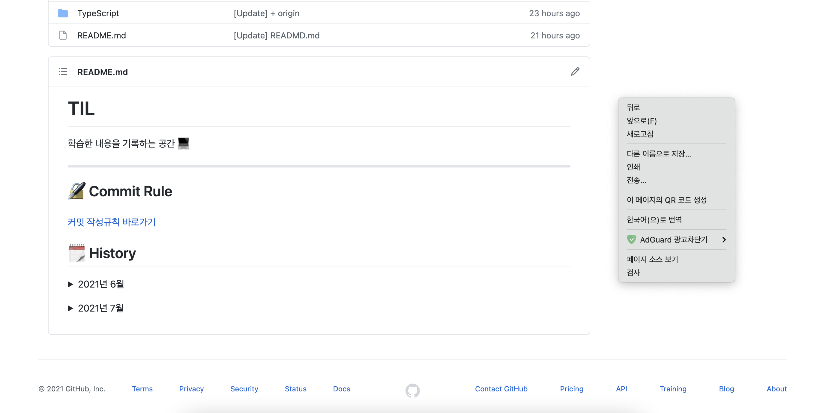
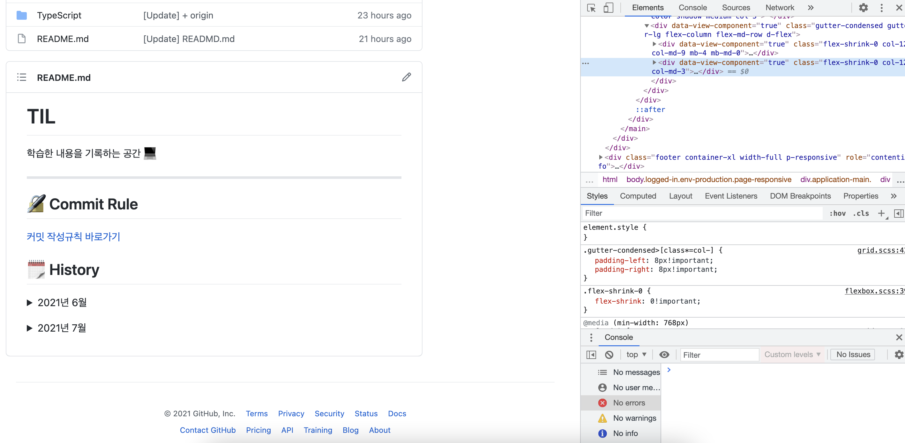

# 크롬 개발자도구
## 정의 📋
- 크롬 브라우저안에 존재하고 있는 도구

## 특징 🙌
- HTTP 통신과정, HTML 구조, CSS 스타일, JavaScript 디버깅, 프로파일링, 성능진단 등을 할 수 있음

## 존재 이유 🧐
1. 문제의 발생
   - HTML에 문제 발생
   - CSS에 문제 발생
   - JS에 문제 발생

2. 위의 문제로 브라우저의 동작과정이 중간에 깨지거나 문제 발생 야기
3. 브라우저가 정상 동작하지 않음
4. 원하는 개발을 할 수 없게 됨

    → 개발 과정 중 어떤 과정이 문제인지 확인 필요

    → `크롬, 인터넷 익스플로러, 파이어폭스, 윈도우, 사파리` 등 같은 브라우저에서 어떻게 일을 하고 있는지 들여다 봐야함

## 사용법 🛠
1. 마우스 우클릭

2. 검사 선택

- window : `f12`
- mac : `fn + F12`

## 기능 🔩

- **돋보기 모양**: HTML 영역 선택

### Element
- HTML과 CSS가 렌더링이 잘되고 화면에 페인팅이 잘 되었는지 확인
- 어떠한 기능들을 테스트
- HTML 속성을 일부 변경

### Network
- 서버와 클라이언트 간에 어떤 데이터들이 주고받았는지 확인

### Sources
- 자바스크립트 개발자들에게 가장 중요한 탭
- 브레이크 포인트가 걸린 부분을 찾아서 원하는 부분을 디버깅 할 수 있음

### Timeline
- 어떤 시간 동안 일어난 일들을 확인

### Resources, Profiles
- 성능 개선을 할 때 유용한 기능

### Audits
- 성능 진단을 하기 위한 기능

### Console
- 간단한 자바스크립트 코딩을 해볼 수 있는 기능
- 브레이크 포인트를 걸어놓은 상태에서 해당히는 시점에 자바스크립트 표현식을 사용하여 테스트를 해볼 수도 있음

- - -
위의 내용은 크롬 개발자도구를 공부하며 개인적으로 정리한 내용입니다.
## 출처 📝

- [프로그래머스 강의 - 크롬을 활용한 프론트엔드 디버깅](https://programmers.co.kr/learn/courses/7)