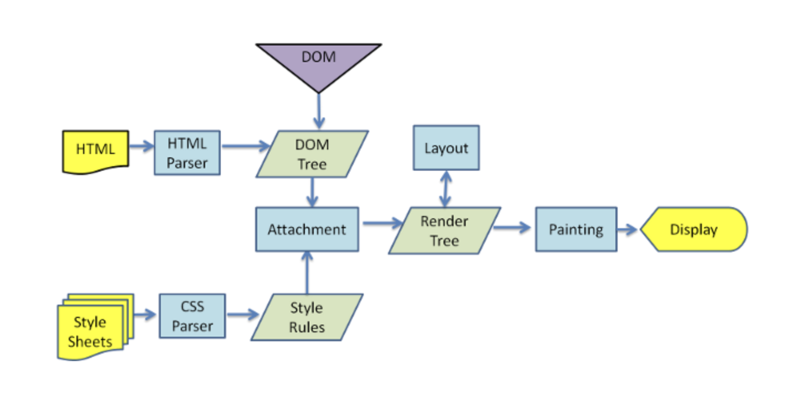

# 브라우저 동작 과정
> **HTML, CSS, JavaScript**는 서버에 어떤 요청을 받았을 때 내려받게 되는 자원들이며 이 자원들은 바로 컴파일이 되어서 내려온 것이 아닌 언어 자체가 그대로 브라우저에서 해석이되고 실행이 됨

1. 서버에 요청하여 **HTML**파일과 **CSS**파일을 내려받음
2. **HTML**은 **DOM Tress**라는 구조로 변환이 돼서 브라우저가 구조적인 오브젝트를 가지고 있게 됨
3. **CSS**는 **CSS Parser**로 **CSS rule**들을 해석
4. 어떤 **HTML**에 어떤 **CSS**를 입혀야하는지 **렌더트리**로 생성
5. 화면에 **Layout**과 **Painting**을 통해 어떤 위치에 어느정도 크기에 어떤 스타일로 표현을 할 지 결정하게 됨
- - -
출처
- [howbrowserworks](https://www.html5rocks.com/en/tutorials/internals/howbrowserswork/)
- [프로그래머스 강의 - 크롬을 활용한 프론트엔드 디버깅](https://programmers.co.kr/learn/courses/7)