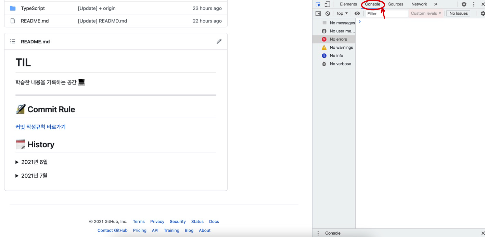

# Console 탭

## 정의 📋
- 자바스크립트의 작은 코드를 브라우저 자바스크립트 파서를 통해서 즉시 실행해볼 수 있는 기능을 제공

## 특징 🙌
- 크롬 개발자 도구에서 가장 많이 쓰이는 기능
- `esc`키로 콘솔탭을 활성/비활성 가능
- 디버깅 과정에서 유용하게 활용
- **간단한 자바스크립트를 테스트할 수 있음**
  ```
  function myName() {
    console.log('Son');
  }
  myName();

  // 'Son'
  // undefined
  ```

  > **회색으로 undefined가 콘솔에 히는 이유?** 리턴값이 없는 경우 무조건 `undefined`를 암묵적으로 반환함
- 전역 변수인 경우 해당 변수 활용 가능

## console.log의 console? 🧐
- 크롬 개발자 도구에서 제공하는 `console`이라는 객체

### console.time, console.timeEnd
```
console.time('start');

for (var i = 0; i < 10000; i++) {
  i = i * 1000;
}

console.timeEnd('start');
```
- `timeEnd`함수에 `time`함수의 인자와 동일한 인자가 들어오는 경우, time과 timeEnd의 시간값을 출력해줌

## 단축키 🛠
### 1. 다음줄 입력
```
shift + Enter
```

- - -
위의 내용은 크롬 개발자도구를 공부하며 개인적으로 정리한 내용입니다.
## 출처 📝

- [프로그래머스 강의 - 크롬을 활용한 프론트엔드 디버깅](https://programmers.co.kr/learn/courses/7)