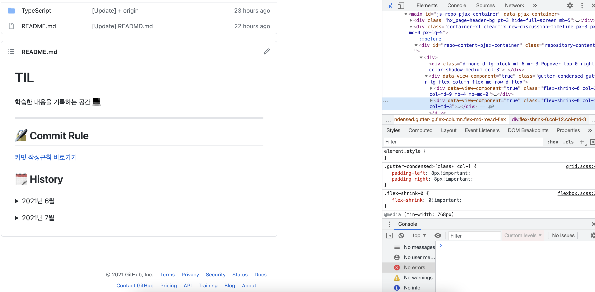
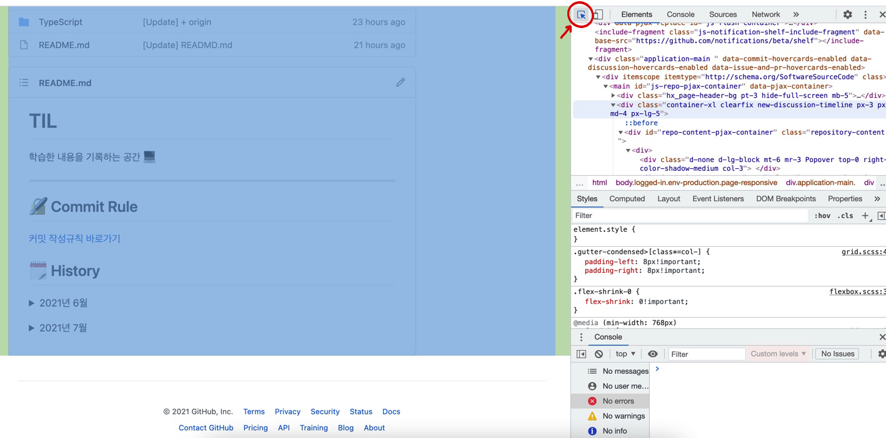
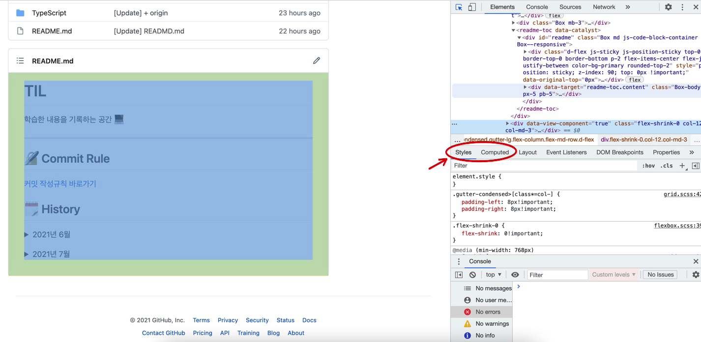
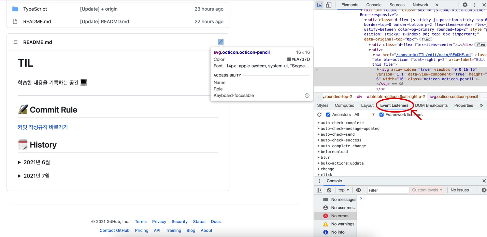

# Elements 탭

## 정의 📋
- HTML, CSS를 어떻게 해석하고 화면에 표시했는지 실제 브라우저의 렌더링 결과를 보여줌
- 결과 뿐만 아니라 HTML 구조나 CSS 속성을 다양한 방법으로 추가/삭제/변경할 수 있어 빠르게 디버깅 가능

## 특징 🙌
- 크롬 개발자 도구를 열었을 때 가장 먼저 노출되는 화면
- 주 기능 : DOM Inspection, CSS 스타일 변경

## 도구 🔩
### 돋보기 마크(Inspection, 검사)

- DOM Node(요소)들을 검사해볼 수 있음
- 요소에 mouseover했을 때 해당 영역이 하이라이트됨
- 요소를 클릭하면 해당하는 요소의 HTML 파악과 함께 변경해볼 수 있음
- 요소를 클릭하면 해당하는 요소의 CSS 파악과 함께 변경해볼 수 있음

### Styles, Computed

- 화면이 렌더링되고 최종적으로 어떤 모습의 CSS를 가지게 되는지 확인 가능

### Event Listners

- 요소를 클릭했을 때 해당하는 이벤트 요소가 무엇인지, 어떤 이벤트가 걸려있는지 확인 가능

- - -
위의 내용은 크롬 개발자도구를 공부하며 개인적으로 정리한 내용입니다.
## 출처 📝

- [프로그래머스 강의 - 크롬을 활용한 프론트엔드 디버깅](https://programmers.co.kr/learn/courses/7)