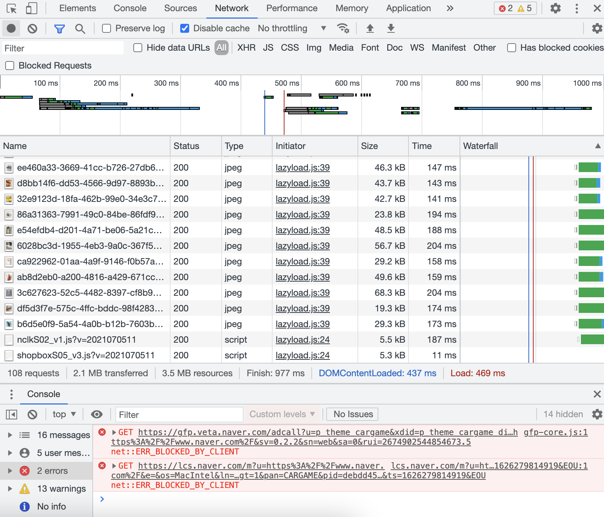

# Network 탭
## 정의 📋
- HTTP 통신 과정을 들여다 볼 수 있는 기능

## 특징 🙌
- **브라우저와 서버 간의 통신과정에서 발생한 문제 파악 가능**
  - 브라우저는 서버로부터 많은 자원을 요청하고 응답 받음, 어떤 자원들이 얼만큼의 크기로 얼마의 시간을 가지고 내려받았는지 자세하게 확인
  - 다양한 성능진단에 유용한 기능

## 요소 🔩
- **Name****: 어떤 파일인지를 나타내는 파일명
- **Status**: 서버로부터 받은 상태값
- **Protocol**
- **Type**
- **Initiator**
- **Size**
- **Time** : 실제 소요된 시간값
- **Timeline-Start Time** : 시간값 중에 실제로 걸린 시간 (서버에서 처리가 늦어진 건지, response가 늦은것 인지)

## DOMContentLoaded
- DOM Tree를 완성하는 시점

## Load
- 이미지 등의 필요한 자원들을 모두 내려받아 더이상 브라우저가 할 일이 없는 시점

- - -
위의 내용은 크롬 개발자도구를 공부하며 개인적으로 정리한 내용입니다.
## 출처 📝

- [프로그래머스 강의 - 크롬을 활용한 프론트엔드 디버깅](https://programmers.co.kr/learn/courses/7)