# Source 탭
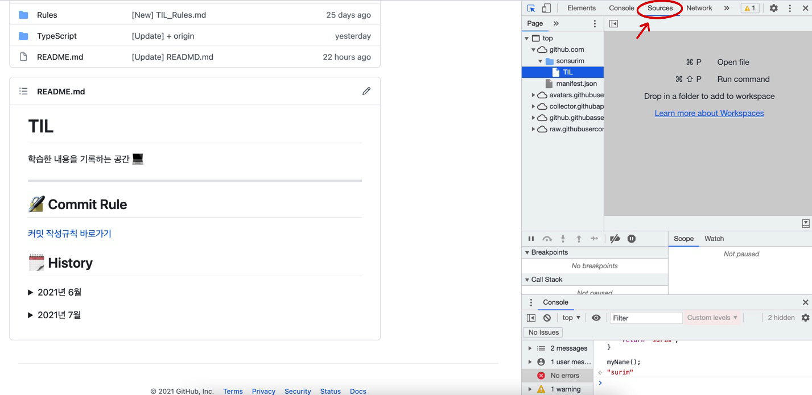

## 정의 📋
- 자바스크립트 실행 중에 BreakPoints를 걸어 그 시점의 Scope 내 변수를 확인할 수 있는 기능

## 특징 🙌
- 크롬 개발자도구에서 가장 중요한 기능
- DOM이 변경되거나 **XHR통신을 하는 시점에 BreakPint를 걸어 디버깅 가능**
- **BreakPoints가 걸리면 watch나 console 탭으로 궁금한 값을 확인**하고 자바스크립트 표현식으로 디버깅 가능

## 자바스크립트 디버깅이 가능한 이유 🧐
- 자바스크립트는 **인터프리터 언어**

  → 자바스크립트는 브라우저에서 런타임 시, 무언가 실행되는 시점에서 바로 해석이 됨

  → 브라우저 내에서 실행되는 시점에 자바스크립트 코드가 어떻게 해석되고 있는지 BreakPoints를 걸어서 멈춰놓고 그 안의 변수값들을 확인해볼 수 있음

## DOM BreakPoints (Dom Node 관련)🛠
1. Source 탭 내 해당 소스코드 라인에 걸기
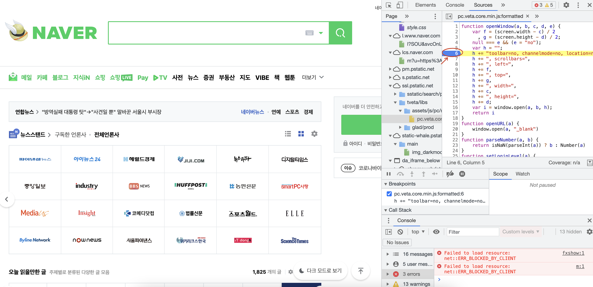

2. Element를 선택 후 해당 Element의 Break on으로 걸기
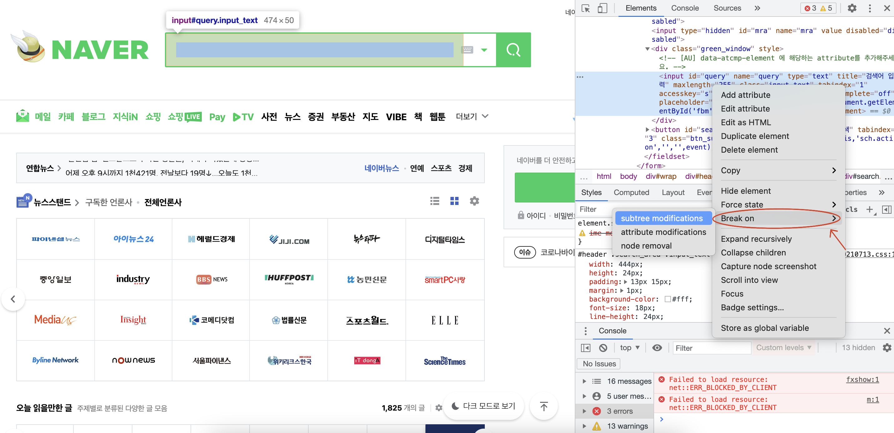

- **`Subtree modifications`**: HTML에 있는 속성이 수정됐을 때 해당 위치의 소스가 멈춤

## XHR BreakPoints (AJAX 통신 관련) 🛠
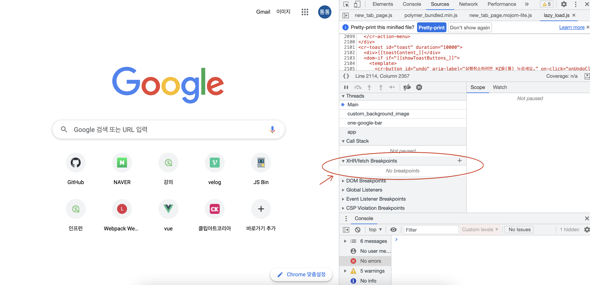

### 사용법
1. 플러스버튼 클릭 후 엔터
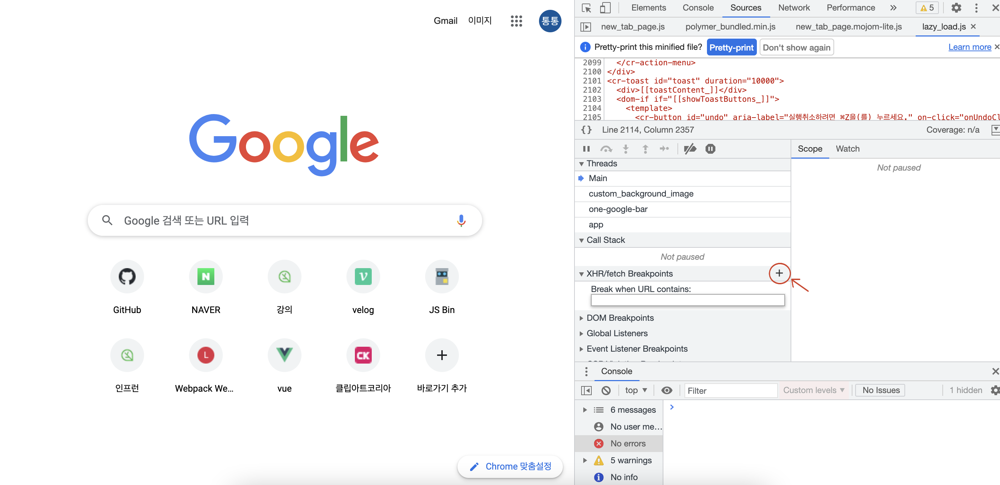
2. 모든 XHR 통신을 할때 멈추는 BreakPoints 생성
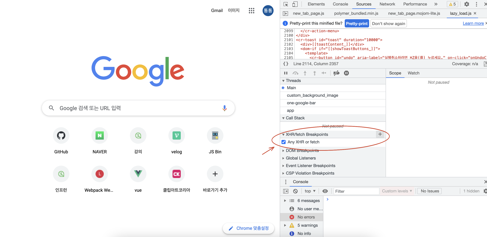

### 결과
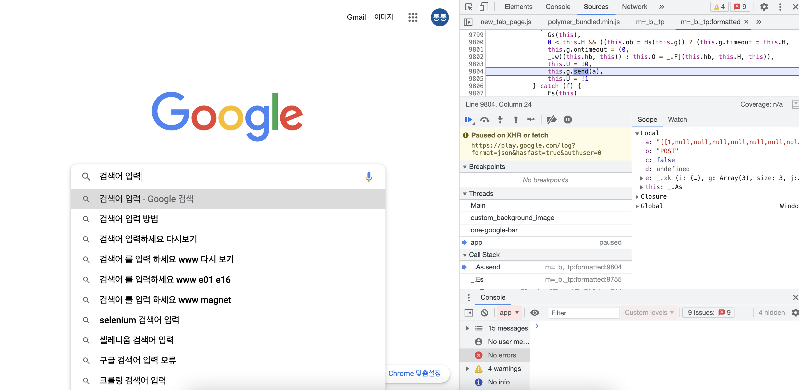
- 검색어를 입력하자(비동기 통신 발생) AJAX 통신을 하고 해당 부분의 소스에서 멈춤

## Scope
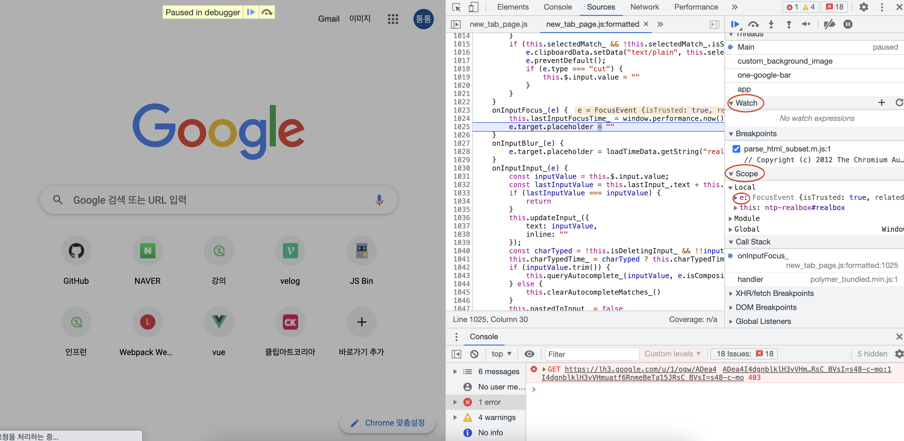

- BreakPoints에서 현재 Scope에 해당하는 모든 변수들을 확인 가능
  - Local
  - Closure : 상위의 부모가 가진 변수
  - Global

## Watch
- BreakPoints 타이밍에 어떤 값을 모니터링하고 싶을 때 사용

### 사용법
1. 모니터링하고 싶은 값을 입력하고 엔터
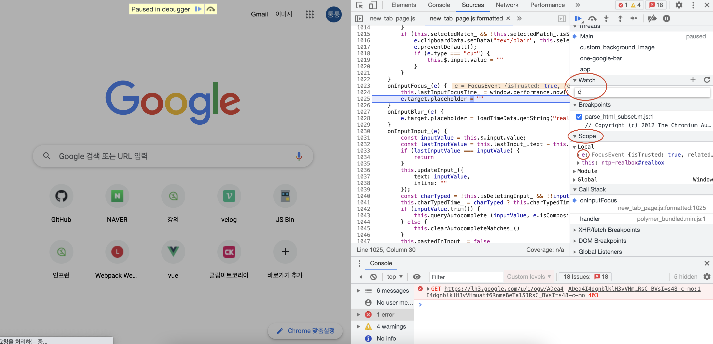
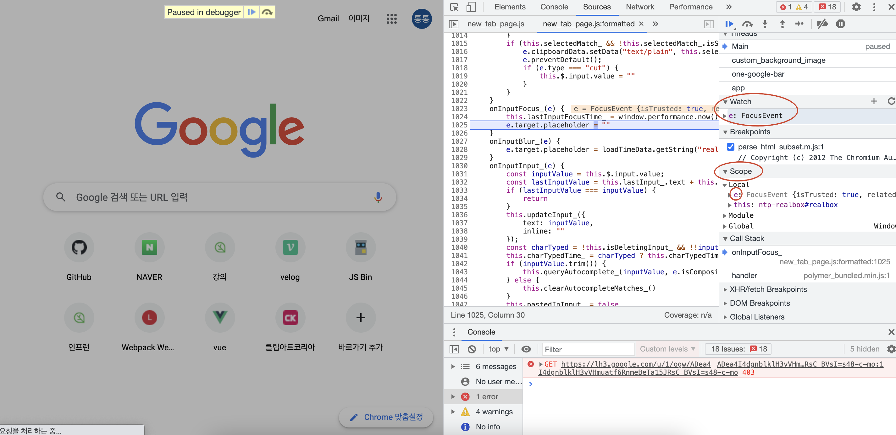
     - 라인을 이동할 때마다 변경되는 값 확인 가능

## Minify된 JavaScript 편하게 보는 방법
### AS-IS
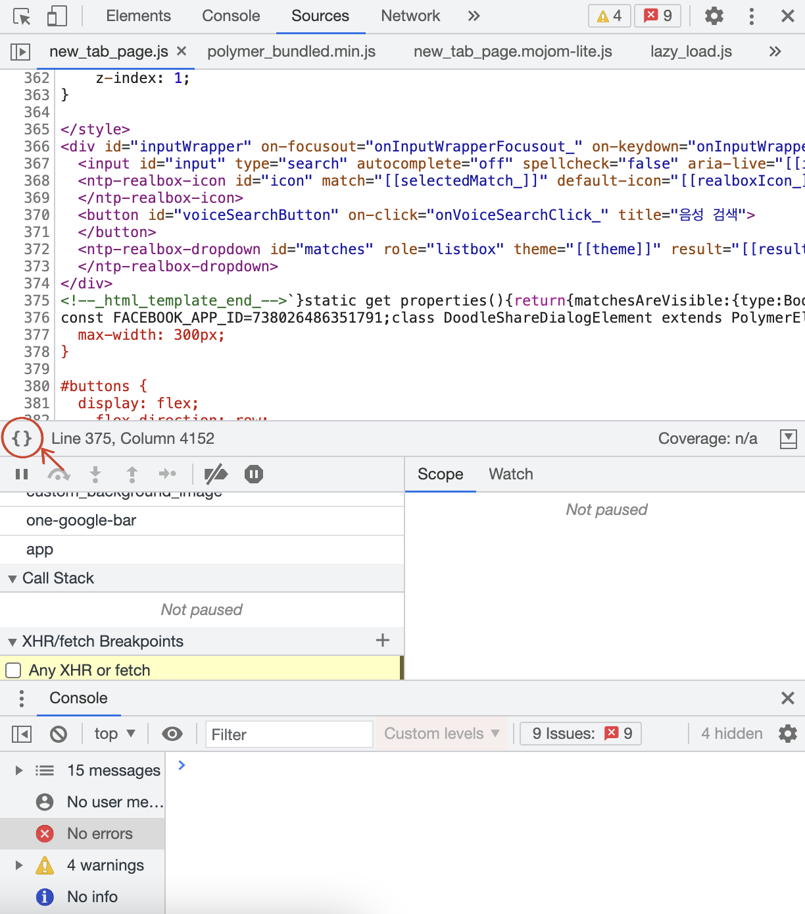

### TO-BE
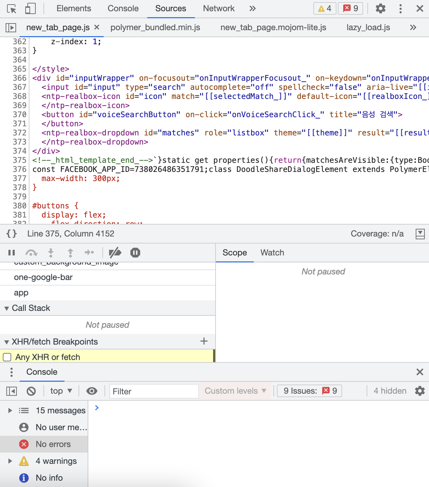

- - -
위의 내용은 크롬 개발자도구를 공부하며 개인적으로 정리한 내용입니다.
## 출처 📝

- [프로그래머스 강의 - 크롬을 활용한 프론트엔드 디버깅](https://programmers.co.kr/learn/courses/7)