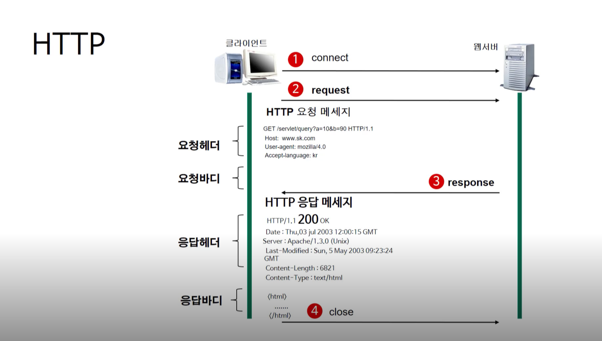

# HTTP 요청/응답 메시지


## Request (요청) ➡️
### **메서드**
- **GET** : 정보를 요청하기 위해 사용 (SELECT)
- **POST** : 정보를 넣기 위해 사용 (INSERT)
- **PUT** : 정보를 업데이트하기 위해 사용 (UPDATE)
- **DELETE** : 정보를 삭제하기 위해 사용 (DELETE)
- **HEAD** : (HTTP)헤더 정보만 요청, 해당 자원이 존재하는지 혹은 서버에 문제가 없는지를 확인하기 위해 사용
- **OPTIONS** : 웹서버가 지원하는 메서드의 종류를 요청
- **TRACE** : 클라이언트의 요청을 그대로 반환, echo 서비스로 서버 상태를 확인하기 위한 목적으로 주로 사용

### **데이터 포맷**
```
// Request Header
GET /servlet/query?a=10&b=90 HTTP/1.1
HOST: www.sk.com
User-agent: mozilla/4.0
Accept-language: kr

// Request Body
```
#### **Request Header.** 첫번째 줄
- `GET` : 요청 메서드
- `/servlet/query?a=10&b=90`: 요청 URI, 요청하는 자원의 위치를 명시해주는 부분
- `HTTP/1.1`: HTTP 프로토콜의 버전, 웹 브라우저가 사용하는 프로토콜의 버전을 명시해주는 부분
#### **Request Header.** 두번째 줄 ~ 마지막 줄
- 여러줄의 헤더 정보가 나옴
- 각각의 줄은 헤더 명과 헤더 값이 콜론으로 구분되어져 있음
- 각 줄은 라인피드와 캐리지 리턴으로 구분됨

#### **Request Body**
- `GET`방식은 요청할 때 가지고 가야되는 자원을 URL에 붙여서 가져가기 때문에 요청 바디가 없음
- `POST`, `PUT`을 사용하게 됐을 때는 들어오게 됨

## Response (응답) ⬅️
```
// Response Header
HTTP/ 1.1 200 OK
DATE: Thu,03 jul 2003 (... 생략)
Server: Apache/1.3.0 (Unix)
Last-Modified: Sun, 5 May 2003 (... 생략)
Content-Length: 6821
Content-Type: text/html

// Response Body
<html>
...
</html>
```
### **데이터 포맷**
#### **Response Header.** 첫번째 줄
- `HTTP/1.1` :응답 HTTP 프로토콜의 버전
- `200`: 응답 코드
- `OK`: 응답 메시지

#### **Response Header.** 두번째 줄 ~ 마지막 줄
- `DATE: Thu,03 jul 2003 ~ `: 날짜
- `Server: Apache/1.3.0 (Unix)`: 웹 서버 이름과 버전
- `Last-Modified: Sun, 5 May 2003 ~ `: 마지막 수정 날짜
- `Content-Length: 6821`: 콘텐츠 길이
- `Content-Type: text/html`: 콘텐츠 타입

### **Response Body**
- 실제 응답 리소스 데이터가 나오는 부분

- - -
위의 내용은 Web을 공부하며 개인적으로 정리한 내용입니다.
## 출처 📝
- [부스트코스 - 웹 프로그래밍 강의](https://www.boostcourse.org/web316/lecture/16661?isDesc=false)
