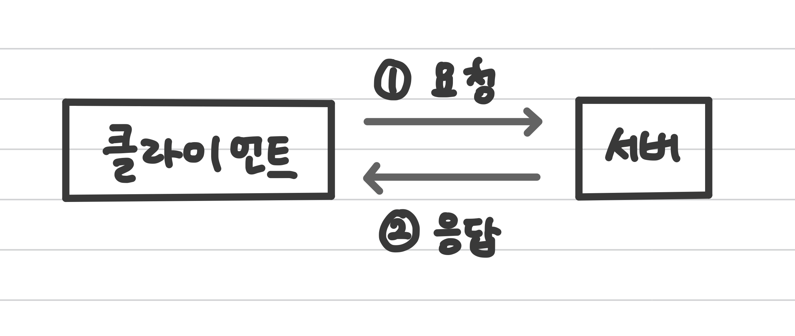

# HTTP (Hypertext Transfer Protocol)

## 정의 📋
- 서버와 클라이언트가 인터넷상에서 데이터를 주고 받기 위한 **프로토콜(protocol)**

  > **프로토콜**? 복수의 컴퓨터 사이나 중앙 컴퓨터와 단말기 사이에서 데이터 통신을 원활하게 하기 위해 필요한 통신 규약

## 특징 🙌
- **무상태(StateLess) 프로토콜**이라고도 불리움
- **암호화가 되지 않은 평문 데이터를 전송하는 프로토콜**

  → HTTP로 비밀번호나 주민등록번호 등을 주고 받으면 제3자가 정보를 조회 가능
  → [HTTPS](https://github.com/sonsurim/TIL/blob/main/HTTP/HTTP_https.md) 등장
- 가장 많이 사용되고 있는 HTTP 버전은 1.1버전
- HTTP는 어떤 종류의 데이터도 전송할 수 있도록 설계되어 있음

  (Ex. 이미지, 동영상, 오디오, 텍스트 문서 등)
- HTTP는 계속 발전하여 HTTP/2까지 버전이 등장한 상태

## 예시로 보는 HTTP 🧐
Ex. 사람과 사람이 전화 통화를 하기 위해 필요한 규약
- 서로 알아들을 수 있는 말 사용
- 한쪽이 말할 때 다른 쪽에서는 듣기
- 전화 연결이 끊어지면 더 대화하지 못함

→ 예시처럼 웹 브라우저와 웹 서버 간에서도 서로 통신하기 위해서는 규약이 필요

→ 이때 필요한 규약이 **HTTP**

## 작동 방식 💪
HTTP는 서버/ 클라이언트 모델을 따름

클라이언트가 <u>먼저 **요청**</u>을 보내고 서버가 클라이언트에게 **응답**을 보내는 방식

  1. **서버와 클라이언트 연결**
  2. 클라이언트 → 서버
     - 요청
  3. 서버 → 클라이언트
      - 클라이언트에게 받은 요청을 응답 결과로 생성
      - 클라이언트에 응답
  4. 서버는 클라이언트와의 **연결을 끊음**

      → 클라이언트가 바로 다음것을 요청해도 서버는 클라이언트가 아까 요청했던 클라이언트인지 아닌지 알 수 없음 (**Stateless 방식**)

## 장점 💪
클라이언트와 서버가 최대 연결 수보다 훨씬 많은 요청과 응답을 처리할 수 있음

###  Ex. 연결이 10대만 접속할 수 있는 서비스
- 10대중 1대를 끊어야 11번째의 사람이 접속 가능

- Stateless는 연결 상태를 계속 유지하는 것이 아님

  → 훨씬 많은 요청과 응답 처리 가능

  → 불특정 다수를 대상으로 하는 서비스에 적합

## 단점 👎
연결을 끊기 때문에 클라이언트가 이전에 무엇을 했는지 알 수 없음

### Ex. 쇼핑몰에서 쇼핑하다가 결제를 하려는 경우
  - 연결을 끊었기 때문에 어떤 것을 쇼핑했는지 모름

    → 이러한 단점을 위해 `Cookie`와 같은 기술이 등장

- - -
위의 내용은 Web을 공부하며 개인적으로 정리한 내용입니다.
## 출처 📝
- [부스트코스 - 웹 프로그래밍 강의](https://www.boostcourse.org/web316/lecture/16661?isDesc=false)
- [망나니개발자 블로그 - HTTP vs HTTPS](https://mangkyu.tistory.com/98)