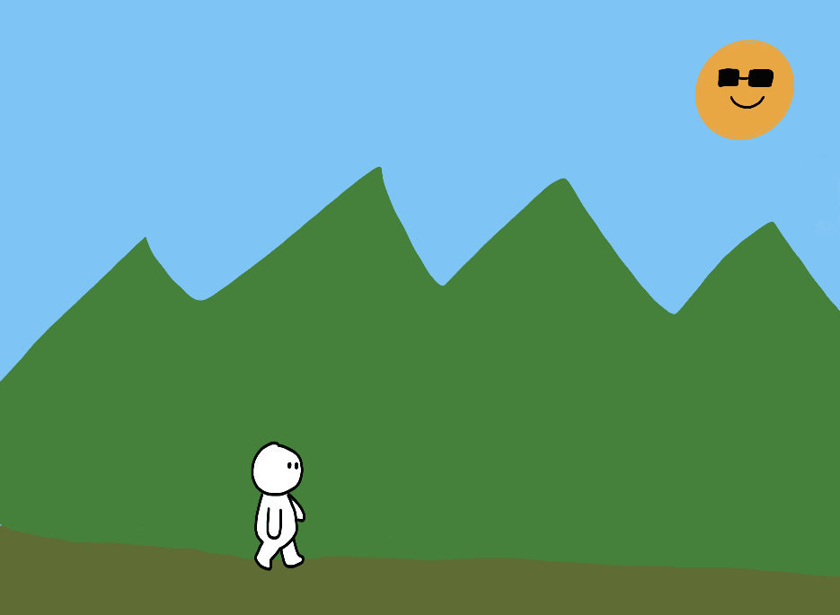
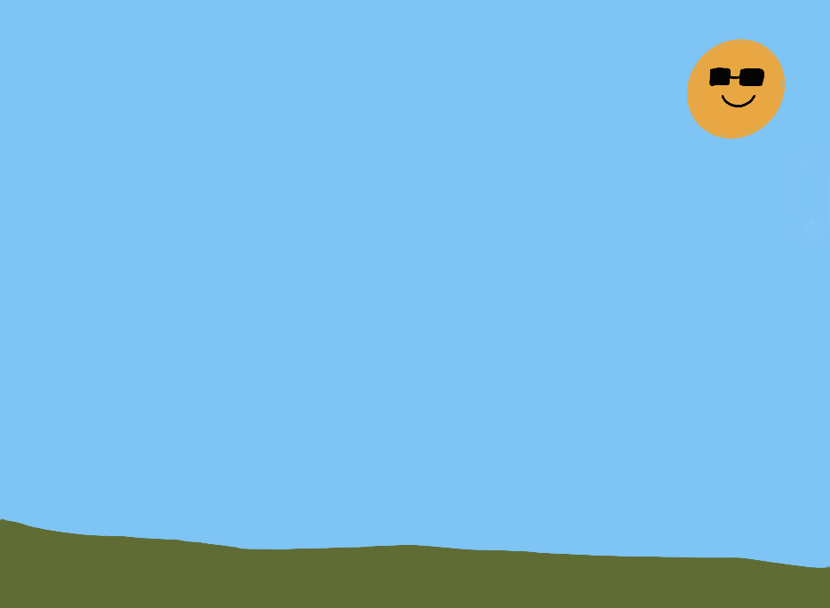
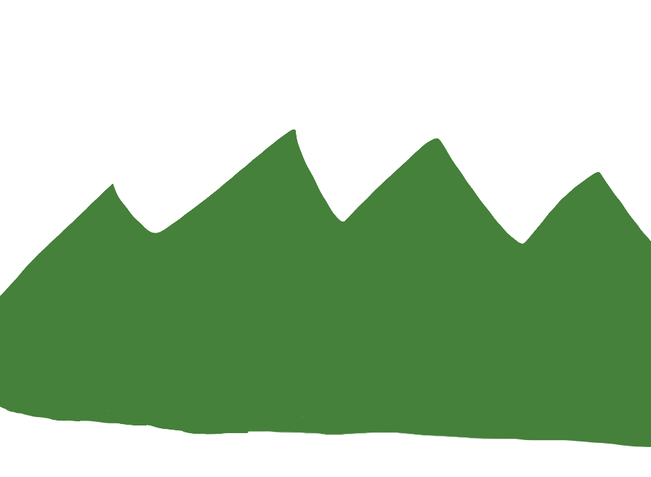
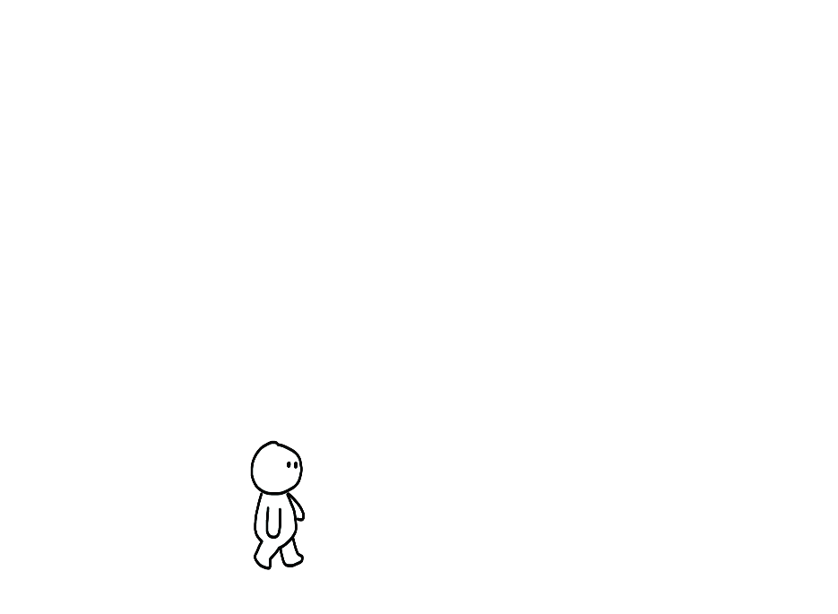
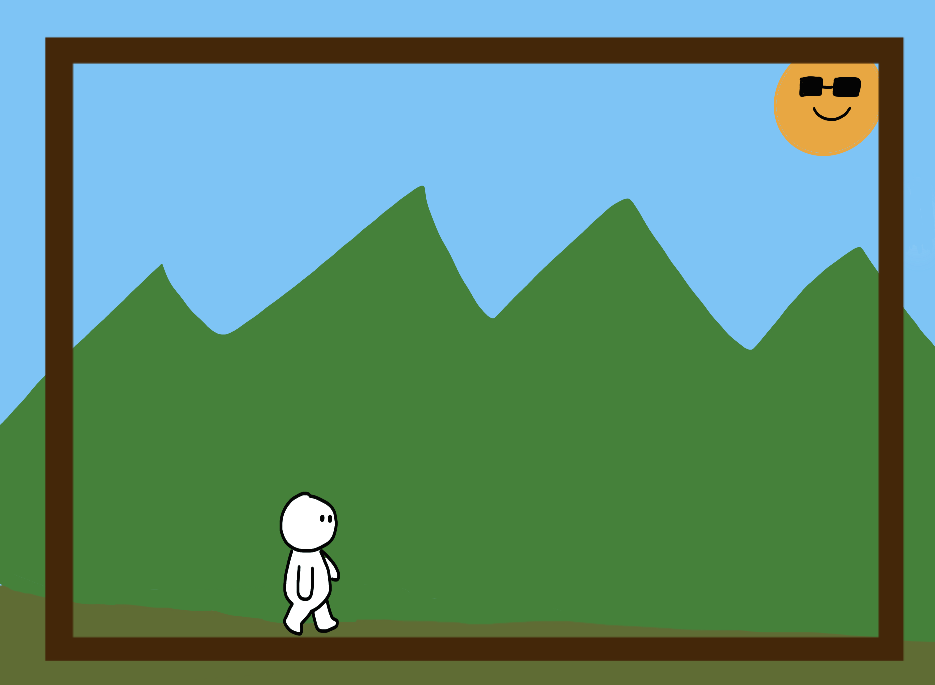
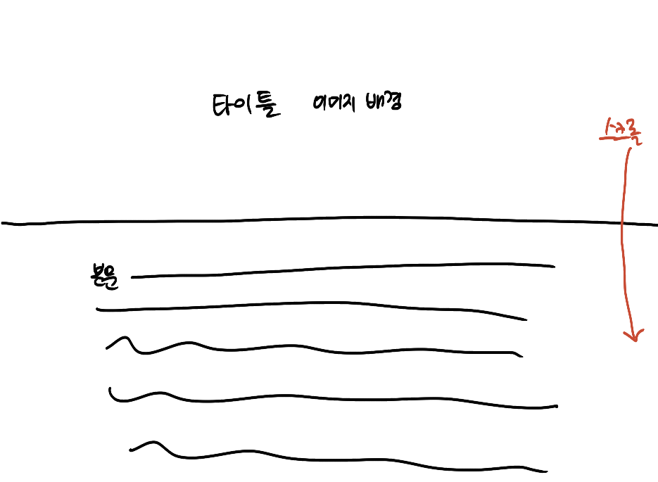

# 패럴랙스 (parallax)

## 동작 원리 💪
- 이미지가 레이어로 되어 있음
- 앞의 레이어는 빠르게 움직이고 뒤의 레이어는 느리게 움직임

## 구성 요소 🔩


### **1. 배경**: 거의 움직이지 않을 백그라운드 배경
  

### **2. 오브젝트1**: 천천히 움직일 요소


### **3. 오브젝트2**: 삐르게 움직일 요소


### **4. 시선**: 패럴렉스가 적용될 부분


## 구현 방법 🛠
### 1. 스크롤이 될 영역 만들기
```
// index.css
body {
  height: 10000px;
  background: linear-gradient(150deg, redorange, yellow, green, indigo, purpleblack);
}
```
- `linear-gradient`: 배경 그라데이션 효과

### 2. 스크롤 이벤트 적용하기
```
// scroll.js
let scrollTop = 0;

function scrollFunc(e) {
  scrollTop = document.documentElement.scrollTop;

  console.log(scrollTop);
}

window.addEventListener('scroll', scrollFunc, false);
```

## 프로그레스 바에 주로 사용되는 퍼센트값 📚
```
let scrollTop = 0;

function scrollFunc(e) {
  scrollTop = document.documentElement.scrollTop;
  let per = Math.round(scrollTop / (document.body.scrollHeight - window.innerHeight) * 100);

  console.log(per);
}

window.addEventListener('scroll', scrollFunc, false);
```
[구현예시 보러가기(private)](https://sonsurim.github.io/interactive-web_private/practice/05/01_progress-width/)

`per = Math.round(scrollTop / (document.documentElement.scrollHeight - window.innerHeight) )* 100;
`

: 퍼센트값 = 현재 스크롤 탑 위치 / (문서 전체 길이 - 윈도우 창 높이 ) * 100;
- 현재 스크롤탑 위치가 전체 화면 길이에서 몇퍼센트 내려와 있는지 구함

## 스크롤 애니메이션 📚
```
cloudWrap.style.transform = `translate(0, ${srollTop / 1.2}px)`
```
[구현예시 보러가기(private)](https://sonsurim.github.io/interactive-web_private/practice/05/02_progress-height/)
- 윈도우 기준, 스크롤 한 번에 100px씩 이동
- 다른 요소들이 100씩 이동할 때 지정한 오브젝트만 100 / 1.2 = 83.3씩 이동 → **이동 속도 감소** → 움직이는 느낌

## 브런치 효과 구현 📚
### CSS
```
// index.css
.cover {
  position: absolute;
  width: 100%;
  height: 800px;
  background: black;
  opacity: .3;
}
.coverImg {
  position: fixed;
  width: 100%;
  height: 800px;
  background: url(./images/bg.JPG) center center / cover no-repeat;
}

section.textWrap {
  position: relative;
  margin-top: 800px;
  background-color: #fff;
}
```

### JS
```
<script>
// index.js
window.addEventListener('scroll', function(e) {
  const scrollTop = document.documentElement.scrollTop;

  title.style.transform = `translate(0, ${-scrollTop/5}px)`;
  cover.style.opacity = .3 + scrollTop / 1000;
  coverImg.style.transform = `scale(${(1 + scrollTop/1000)})`
})
  </script>
```
[구현예시 보러가기(private)](https://sonsurim.github.io/interactive-web_private/practice/05/03_brunch/)
- 상단의 이미지는 고정
- 이미지 위에 존재할 컨텐츠 배경색이 있는 레이어 존재 필요




- 스크롤이 될 때마다 스케일이 커짐 → 그 위에 텍스트 레이어가 올라옴
- 이미지 아래에 있는 컨텐츠가 **이미지 컨텐츠 위로 덮여야 함**

- - -
위의 내용은 Interactive Web을 공부하며 개인적으로 정리한 내용입니다.
## 출처 📝
- [인프런 강의 - 몇 줄로 끝내는 인터랙티브 웹 개발 노하우 [초급편]](https://www.inflearn.com/course/%EC%9E%90%EB%B0%94%EC%8A%A4%ED%81%AC%EB%A6%BD%ED%8A%B8-%EC%9D%B8%ED%84%B0%EB%9E%99%ED%8B%B0%EB%B8%8C-%EC%9B%B9/dashboard)