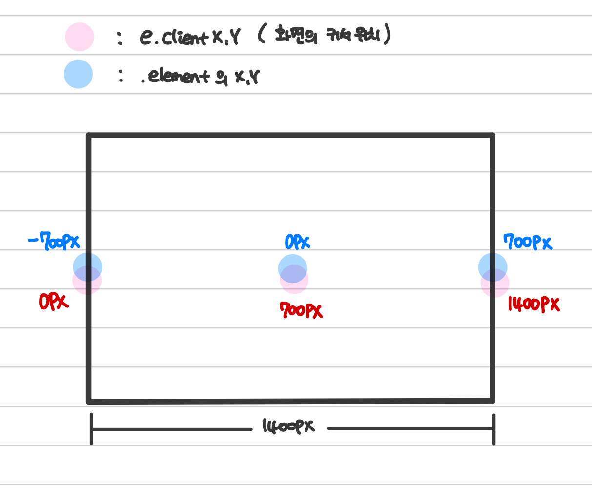
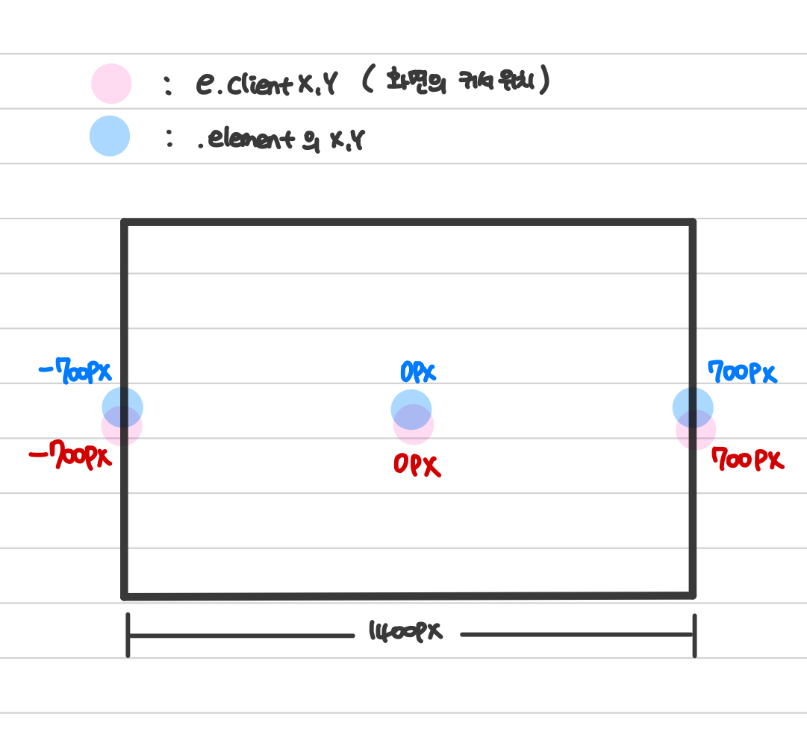

# Interactive Web Tip

## CSS 수평 가운데 정렬 📚
```
// index.css
.element {
  position: absolute;
  width: 300px;
  left: calc(50% - 150px);
}
```
## 마우스 커서의 기준 가운데로 설정 📚
- `clientX` : 브라우저에서 사용자에게 웹페이지가 보여지는 영역을 기준으로 X좌표
- `clentY` : 브라우저에서 사용자에게 웹페이지가 보여지는 영역을 기준으로 Y좌표

### AS-IS


```
window.addEventListener('mousemove', mouseFunc, false);

function mouseFunc(e) {
  let x = e.clientX;
  let y = e.clientY;
}
```
- 마우스의 시작점: 왼쪽 상단
- 요소의 시작점: 현재 커서 위치 + 화면 크기의 절반 (요소를 CSS로 중간에 위치하게 했기 때문에)

## TO-BE



```
window.addEventListener('mousemove', mouseFunc, false);

function mouseFunc(e) {
  let x = (e.clientX - window.innerWidth / 2);
  let y = (e.clientY - window.innerHeight / 2);

  elemnent.style.transform = `translate(${x}px, ${y}px)`;
}
```
- 마우스의 시작점: 정중앙
- 요소의 시작점: 정중앙

  → **마우스의 기준을 중간으로 설정**

## 마우스 동작 범위 줄이기 (효과 감소) 📚
```
window.addEventListener('mousemove', mouseFunc, false);

function mouseFunc(e) {
  let x = (e.clientX - window.innerWidth / 2);
  let y = (e.clientY - window.innerHeight / 2);

  elemnent.style.transform = `translate(${x / 6}px, ${y / 6}px)`;
}
```

## 부드러운 애니메이션 효과 설정 📚
**requsetAnimationFrame** 설정
```
let x = 0;
let y = 0;
let mouseX = 0;
let mouseY = 0;
let speed = 0.003;

window.addEventListener('mousemove', mouseFunc, false);

function mouseFunc(e) {
  x = (e.clientX - window.innerWidth / 2);
  y = (e.clientY - window.innerHeight / 2);
}

function loop() {
  mouseX += (x - mouseX) * speed;
  mouseY += (y - mouseY) * speed;

  human.style.transform = `translate(${mouseX / 6}px, ${mouseY / 6}px)`;

  window.requestAnimationFrame(loop);
}

loop();
```

- - -
위의 내용은 Interactive Web을 공부하며 개인적으로 정리한 내용입니다.
## 출처 📝
- [인프런 강의 - 몇 줄로 끝내는 인터랙티브 웹 개발 노하우 [초급편]](https://www.inflearn.com/course/%EC%9E%90%EB%B0%94%EC%8A%A4%ED%81%AC%EB%A6%BD%ED%8A%B8-%EC%9D%B8%ED%84%B0%EB%9E%99%ED%8B%B0%EB%B8%8C-%EC%9B%B9/dashboard)