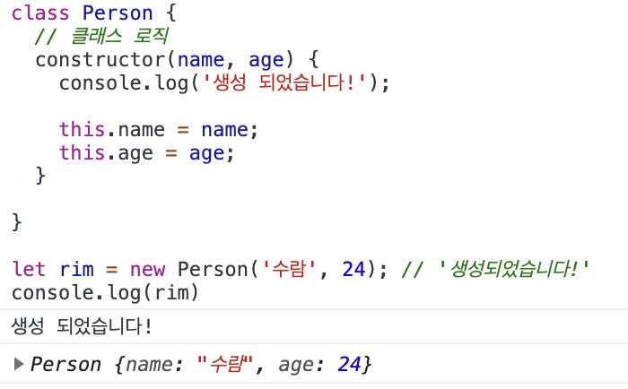

# JavaScript 클래스

## 역할 💪
- 인스턴스를 생성해주는 역할
- 클래스에 필요한 값들을 넘겨서 객체의 기본 속성,API 또는 함수들을 사용할 수 있게 함

## 문법 🔏
 기존에 있었던 문법인 생성자 함수의 syntactic sugar
  - AS-IS
  ```
  function Person(name, age) {
    this.name = name;
    this.age = age;
  }

  let rim = new Person('rim', 300);
  ```

  - TO-BE
  ```
  class Person {
    constructor(name, age) {
      this.name = name;
      this.age = age;
    }
  }

  let rim = new Person('rim', 300);
  ```
- `constructor`
  - 초기화 메소드
  - class를 생성했을 때 constructor안의 로직이 실행



- 클래스로 초기화 시키고 인스턴스를 만들어낸 객체를 변수에 담을 수 있음

- - -
위의 내용은 JavaScript를 공부하며 개인적으로 정리한 내용입니다.
## 출처 📝
- [인프런 강의 - 타입스크립트 입문 기초부터 실전까지](https://www.inflearn.com/course/%ED%83%80%EC%9E%85%EC%8A%A4%ED%81%AC%EB%A6%BD%ED%8A%B8-%EC%9E%85%EB%AC%B8/dashboard)