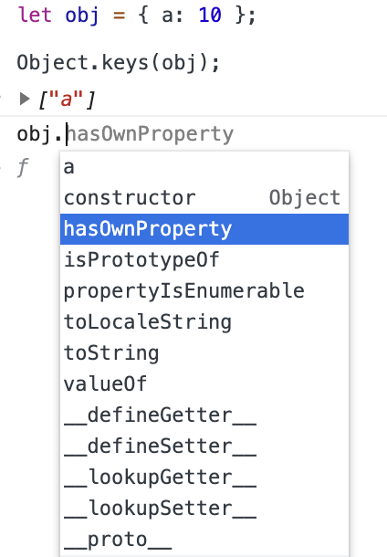

# JavaScript 프로토타입
JavaScript는 프로토타입 기반의 언어
## 역할 💪
- 객체의 정보를 확장
- 확장한 객체에서 기존에 정의되어 있는 기능들을 활용
## AS-IS 👎

```
let user = { name: 'rim', age: 100};

let admin = { name: 'rim', age: 100, role: 'admin }
```
- 기존의 user의 속성들을 기본으로 하고 어드민에 대한 속성을 추가로 부여하는 경우, **user의 속성들이 중복**

## To-BE 👍

```
let user = { name: 'rim', age: 100};

let admin = {};
admin.__proto__ = user;

// user의 속성들을 재활용 가능해진 형태
admin.name // 'rim'
admin.age // 100

admin // {}
admin.role = 'admin';
admin // {role: 'admin'}
```
- `admin.__proto__ = user;` : 프로토타입의 상위에 user객체를 상속
- admin에는 빈 객체
- admin의 프로토 타입에서 age와 name이 제공
- prototype(상위 object)의 속성 사용 가능

## 활용 사례 📚
### - Built-in JavaScript API (JavaScript Native API)
- 기본적으로 객체를 생성하면 상위의 프로토타입이 Object라고 하는 최상위 프로토타입 객체가 있기 때문에 Object 객체에 정의되어 있는 메소드와 속성들 사용가능했었음



- - -
위의 내용은 JavaScript를 공부하며 개인적으로 정리한 내용입니다.
## 출처 📝
- [인프런 강의 - 타입스크립트 입문 기초부터 실전까지](https://www.inflearn.com/course/%ED%83%80%EC%9E%85%EC%8A%A4%ED%81%AC%EB%A6%BD%ED%8A%B8-%EC%9E%85%EB%AC%B8/dashboard)