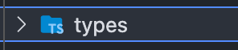
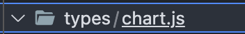
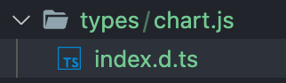

# @types 라이브러리
## 정의
- 자바스크립트로 만들어진 라이브러리에 대한 타입이 정의되어 있는 **보조 라이브러리**

## 사용 이유
- 자바스크립트로 만들어진 써드 파티 라이브러리(jQuery, lodash, chart 등)를 타입스크립트에서 사용하려면 각 기능에 대한 타입이 정의되어 있어야 함

## 내부 구조
- 일반적으로 `index.d.ts` 파일과 `package.json` 파일로 구성
- `package.json` 파일 안에는 `types` 속성이 정의

> inde.d.ts? 타입의 정의만 모아놓는 파일
## 사용 예시
```
import $ from 'jquery';

$(document).ready();
```
- 제이쿼리 라이브러리의 내부 코드에 대한 타입이 정의되어 있지 않아 이 라이브러리를 들고 와서 사용할 때 타입스크립트 파일에서 타입 추론을 할 수 없기 때문에 위 코드는 에러 발생
→ `@types` 라이브러리 설치

```
npm i -D @types/jquery
```
- 흔히 사용되는 자바스크립트 라이브러리는 대부분 `@types`라는 별칭으로 타입스크립트 추론이 가능한 보조 라이브러리를 제공

## @types 라이브러리(타입 정의 파일)를 제공하지 않는 경우
1. tsconfig에 `typeRoots` 속성 선언
  ```
  "typeRoots": ["./node_modules/@types", "./types"]
  ```
2. 프로젝트 루트에 `types` 디렉토리 생성



3. `types` 디렉토리에 `@types`라이브러리를 제공하지 않는 라이브러리명의 디렉토리 생성



4. 해당 디렉토리에 `index.d.ts`파일 생성



5. `index.d.ts`에 해당하는 라이브러리 모듈 선언
```
declare module 'chart.js';
```

6. +) 추가로 타입을 따로 지정도 가능
```
declare module 'chart.js' {
  interface MyChart {}
}
```
- [d.ts 파일을 제작하는 방법](https://www.typescriptlang.org/docs/handbook/declaration-files/dts-from-js.html)