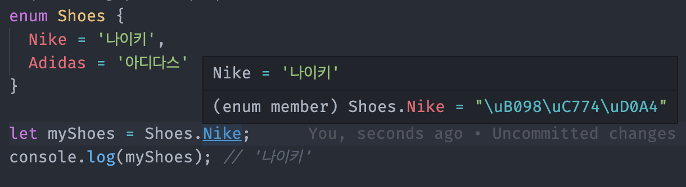

# TypeScript 이넘

## 정의 📋
- 특정 값들의 집합을 의미하는 자료형
- 타입스크립트에서 숫자형 이넘, 문자형 이넘 제공

## 특징 🙌
- enum을 사용했을 때 별도의 값을 사용하지 않으면 기본값으로 `숫자 0`을 할당함
## 숫자형 이넘 🔩
```
enum Shoes {
  Nike,       // 0
  Adidas,     // 1
  NewBalance  // 2
}

let myShoes = Shoes.Nike;
console.log(myShoes); // 0
```


- 값을 이용하지 않는 경우, 자동으로 숫자를 할당

```
enum Shoes {
  Nike = 10,   // 10
  Adidas,      // 11
  NewBalance   // 12
}

let myShoes = Shoes.Nike;
console.log(myShoes); // 10
```
- 다른 숫자를 초기화를 하는 경우 자동으로 1씩 증가해서 할당

## 문자형 이넘 🔩


```
enum Shoes {
  Nike = '나이키',
  Adidas = '아디다스'
}

let myShoes = Shoes.Nike;
console.log(myShoes); // '나이키'
```

## 활용 예시 📚
- **AS-IS (string)**
    ```
    function askQuestion(answer: string) {
      if (answer === 'yes') {
      console.log('정답입니다!');
      }
      if (answer === 'no') {
        console.log('오답입니다!');
      }
    }

    askQuestion('예스');
    askQuestion('Y');
    askQuestion('yes');
    ```
    다양한 형태의 문자열을 넣을 수 있음

- **To-BE (Enum)**
    ```
    enum Answer {
      Yes = 'Y',
      No = 'N'
    }

    function askQuestion(answer: Answer) {
      if (answer === Answer.Yes) {
      console.log('정답입니다!');
      }
      if (answer === Answer.No) {
        console.log('오답입니다!');
      }
    }

    askQuestion(Answer.Yes);
    askQuestion('Yes');       // Error!
    askQuestion('예스');       // Error!
    askQuestion('Y');         // Error!
    ```
    - 문자열을 구체적인 값으로 지정
    - 이넘을 이용한 정의기 때문에 'Yes'도 오류 발생
    - 이넘에서 제공하는 데이터만 넘길 수 있음

- - -
위의 내용은 TypeScript를 공부하며 개인적으로 정리한 내용입니다.
## 출처 📝
- [인프런 강의 - 타입스크립트 입문 기초부터 실전까지](https://www.inflearn.com/course/%ED%83%80%EC%9E%85%EC%8A%A4%ED%81%AC%EB%A6%BD%ED%8A%B8-%EC%9E%85%EB%AC%B8/dashboard)
- [인프런 강의 - 실전 프로젝트로 배우는 타입스크립트](https://www.inflearn.com/course/%ED%83%80%EC%9E%85%EC%8A%A4%ED%81%AC%EB%A6%BD%ED%8A%B8-%EC%8B%A4%EC%A0%84/dashboard)
- [인프런 강의 - Vue.js + TypeScript 완벽 가이드](https://www.inflearn.com/course/vue-ts/dashboard)
