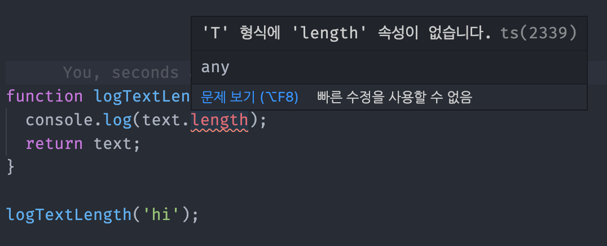

# TypeScript 제네릭

## 정의 📋
- 타입이 이미 정의되어 있는 것이 아니라 호출하는 시점에 타입을 넘겨줄 수 있는 것
## 특징 🙌
- 타입을 마치 함수의 파라미터의 개념으로 받음 => 함수를 호출할 때 파라미터에 대한 타입을 지정해서 보낼 수 있음
- C#, Java 등 타입이 들어간 언어에서 가장 많이 활용됨
- 재사용성이 높은 컴포넌트를 만들 때 자주 활용됨
- **API를 호출해서 API 응답의 규칙을 정의할 때 가장 많이 쓰임**

## 장점 👍
- 정확한 타입 추론으로 실행 환경에서 제공되는 메소드 사용 가능
### 코드로 보는 장점
```
// AS-IS
interface Email {
  value: string;
  selected: boolean;
}

interface ProductNumber {
  value: number;
  selected: boolean;
}

const emails: Email[] = [
  { value: 'naver.com', selected: true },
  { value: 'google.com', selected: false },
  { value: 'hanmail.net', selected: false }
];

const numberOfProducts: ProductNumber[]= [
  { value: 1, selected: true },
  { value: 2, selected: false },
  { value: 3, selected: false },
]

function createDropdownItem(item: Email| ProductNumber ) {
  const option = document.createElement('option');
  option.value = item.value.toString();
  option.innerText = item.value.toString();
  option.selected = item.selected;
  return option;
}

emails.forEach(function (email) {
  const item = createDropdownItem(email);
  const selectTag = document.querySelector('#email-dropdown');
  selectTag.appendChild(item);
});

numberOfProducts.forEach(function (product) {
  const item = createDropdownItem(product);
});
```
- **AS-IS**
  - 동일한 속성에 타입이 바뀐 형태임에도 각각의 인터페이스 정의에 의한 코드가 늘어남
  - 타입이 추가되는 경우, 매번 인터페이스를 정의해주어야 함

```
// TO-BE
interface DropdownItem<T> {
  value: T;
  selected: boolean;
}

const emails: DropdownItem<string>[] = [
  { value: 'naver.com', selected: true },
  { value: 'google.com', selected: false },
  { value: 'hanmail.net', selected: false }
];

const numberOfProducts: DropdownItem<number>[]= [
  { value: 1, selected: true },
  { value: 2, selected: false },
  { value: 3, selected: false },
]

function createDropdownItem(item: DropdownItem<string> | DropdownItem<number> ) {
  const option = document.createElement('option');
  option.value = item.value.toString();
  option.innerText = item.value.toString();
  option.selected = item.selected;
  return option;
}

emails.forEach(function (email: DropdownItem<string>) {
  const item = createDropdownItem(email);
  const selectTag = document.querySelector('#email-dropdown');
  selectTag.appendChild(item);
});

numberOfProducts.forEach(function (product: DropdownItem<number>) {
  const item = createDropdownItem(product);
});
```
- **TO-BE**
  - `DropdownItem`을 사용할 때 타입을 정의
  - 기존의 dropdown의 타입을 각각 인터페이스로 정의하는 것이 필요 없어짐
  - **하나의 인터페이스에 제네릭을 이용하여 여러가지 타입 커버 가능**
## 문법 🔏
### 1. 함수에서의 제네릭
```
function logText<T>(text: T): T {
  console.log(text);
  return text;
}

logText<string>('안녕')
```
- `<string>` : logText 함수 내부에서 처리하는 text에 대한 타입은 파라미터로 받은 string
- `logText<string>('안녕')`
  - logText라는 함수에 인자를 넘김
  - 해당 인자의 타입은 string이라고 제네릭으로 직접 정의

### 2. 인터페이스에서의 제네릭
```
// AS-IS
interface Dropdown {
  value: string;
  selected: boolean;
}
const obj: Dropdown = { value: 'abc', selected: false }

// TO-BE
interface Dropdown<T> {
  value: T;
  selected: boolean;
}

const obj1: Dropdown<string> = { value: 'abc', selected: false };
const obj2: Dropdown<number> = { value: 123, selected: false };
```
- **AS-IS**
  - `value`에는 string 타입만 가능

- **TO-BE**
  - interface안에 특정 타입을 추가로 정의 필요
  - `value`의 타입이 전달하는 타입으로 정의

### 3. Promise에서의 제네릭
```
// 동기 함수
function fetchItems() {
  let items = ['a', 'b', 'c'];
  return items;
}

let result = fetchItems();
console.log(result);

// 비동기 함수
function asyncFetchItems(): Promise<string[]>  {
  let items = ['a', 'b', 'c'];
  return new Promise( (resolve, reject) => {
    resolve(items);
  });
}
```
Promise는 기본적으로 제네릭을 이용해서 정의되어 있음
- **동기 함수**
  - `fetchItems`는 return 타입을 정의하지 않아도 함수 내부에서 선언한 변수를 돌려주는 동기적인 함수이기 때문에 타입스크립트 내부에서 기본적으로 `string[]`이라는 것을 추론하고 있음
- **비동기 함수**
  - `new Promise`를 반환하게 되면 함수에서 기본적으로 `Promise`를 추론하지만 **Promise안의 어떤 타입인지 추론하지 못함**
  - `asyncFetchItems` 함수를 실행하는 시점에서 타입스크립트가 `Promise`안에 들어오는 비동기 코드들에 대해서 알 수 없음 =>  (`Promise<unknown>`으로 추론됨)
  - **비동기 처리를 통해서 return 타입이 어떤 것인지 명시해주어야 함**
  - `Promise<string[]>` : Promise에 resolve된 `items`라는 값이 Promise의 반환타입(`<string[]>)`이 됨

## 제네릭의 타입 제한 🛠
제네릭을 더욱 엄격하게 사용 || 제네릭에 더 많은 옵션들을 사용할 때 접근하는 방식
### 1. 제네릭에 특정 타입의 모습 지정


- `logTextLength`에 문자열을 넣었지만 typescript입장에서는 `logTextLength`에 어떤 타입이 들어올지 알 수 없기 때문에 `.length`라는 메소드가 있다는 것은 개발자만 알 수  있음

```
// TO-BE
function logTextLength<T>(text: T[]): T[] {
  console.log(text.length);
  text.forEach( text => console.log(text))
  return text;
}

logTextLength<string>(['hi', 'abc']);
```
  - `T`라고 하는 제네릭에 배열이 온다는 것을 암시하여 `.length` 메소드가 있을거라는 힌트를 줌
  - 타입스크립트는 배열 타입으로 가정하고 해당하는 메소드를 제공

### 2. 정의된 타입 이용
정의된 타입을 이용해서 제네릭에 들어갈 수 있는 타입들을 구분
```
interface LengthType {
  length: number;
}

function logTextLength<T extends LengthType>(text: T): T {
  text.length;
  return text;
}

// Success
logTextLength('a');
logTextLength([1]);
logTextLength({length: 10})

// Fail
logTextLength({leng: 10});
logTextLength(10);
```
- `LengthType` 인터페이스는 `length`라는 속성이 number라는 타입을 가짐
- 제네릭을 받은 타입은 항상 `LengthType`의 하위 타입일 것을 명시
  - **`length` 속성을 가지고 있는 인자만 받음**
  - => 함수 내부에서 `LengthType` 타입의 속성인 `.length` 기본 제공

- **Success**
    - `logTextLength('a')` : 문자열은 내부 속성으로 length가 제공
    - `logTextLength([1])` : 배열은 내부 속성으로 length가 제공
    - `logTextLength({length: 10})` : 객체에 length 속성이 있음


- **Fail**
    - `logTextLength({leng: 10})` : 객체는 내부 속성으로 length가 제공되지 않음, 따로 length 속성 정의 필요한데 객체에 length 속성이 없음
    - `logTextLength(10)`: 숫자는 length가 내부 속성으로 제공되고 있지 않음

### 3. keyof 예약어 이용
```
interface ShoppingItem {
  name: string;
  price: number;
  stock: number;
}

function getShoppingItemOption<T extends keyof ShoppingItem>(itemOption: T): T {
   return itemOption;
}

getShoppingItemOption('name')
getShoppingItemOption('price')
getShoppingItemOption('stock')
```
- `ShoppingItem` 인터페이스에 정의되어 있는 속성(`name,price,stock`) 중 하나만 받도록 제한
- `ShoppingItem` 인터페이스에 있는 key 중 한가지가 제네릭이 될 것이라고 명시
- `'name', 'price', 'stock'`중 한가지만 인자로 들어올 수 있음

## 같은 코드로 보는 타입 특징 ⚖️
### - 기존 타입
```
function logText(text: string) {
  console.log(text);
  return text;
}

function logNumber(num: number) {
  console.log(num);
  return num;
}

logText('a');
const num = logNumber(10);
```
- 타입을 다르게 받기 위해 중복되는 코드들을 생산하게 됨

### - 유니온 타입
```
function logText(text: string | number) {
  console.log(text);
  text.
  return text;
}

const a = logText('a');
console.log(a);
logText(10);
```
- 타입을 다르게 보낼때의 문제는 해결됨 (input에 대한 문제)
- 공통으로 접근할 수 있는 속성이나 API에 대해서만 자동완성 제공 (output에 대한 문제)
- 반환 타입이 정확하게 추론되지 않음 > 해당 타입에 대한 메소드 사용 불가 (output에 대한 문제)

### - 제네릭
```
function logText<T>(text: T): T {
  console.log(text);
  return text;
}

const abc = logText<string>('abc');

abc.toString()

const login = logText<boolean>(true);
```
- `<T>` : 제네릭 사용 선언
  - 함수를 정의할 때 받은 타입을 파라미터의 타입으로 정의
  - 리턴값의 타입으로 정의
- 호출할 때 타입 정의 > 인자와 반환값 타입 자동 정의
- 정확한 타입 추론 > 해당하는 메소드 사용 가능

## 제네릭 타입의 리팩토리 예시 📚
```
// AS-IS
interface DropdownItem<T> {
  value: T;
  selected: boolean;
}

const emails: DropdownItem<string>[] = [
  { value: 'naver.com', selected: true },
  { value: 'google.com', selected: false },
  { value: 'hanmail.net', selected: false }
];

const numberOfProducts: DropdownItem<number>[]= [
  { value: 1, selected: true },
  { value: 2, selected: false },
  { value: 3, selected: false },
]

function createDropdownItem(item: DropdownItem<string> | DropdownItem<number> ) {
  const option = document.createElement('option');
  option.value = item.value.toString();
  option.innerText = item.value.toString();
  option.selected = item.selected;
  return option;
}

emails.forEach(function (email: DropdownItem<string>) {
  const item = createDropdownItem(email);
  const selectTag = document.querySelector('#email-dropdown');
  selectTag.appendChild(item);
});

numberOfProducts.forEach(function (product: DropdownItem<number>) {
  const item = createDropdownItem(product);
});
```
- `createDropdownItem`의 타입을 유니온으로 받고 있음

```
// TO-BE
interface DropdownItem<T> {
  value: T;
  selected: boolean;
}

const emails: DropdownItem<string>[] = [
  { value: 'naver.com', selected: true },
  { value: 'google.com', selected: false },
  { value: 'hanmail.net', selected: false }
];

const numberOfProducts: DropdownItem<number>[]= [
  { value: 1, selected: true },
  { value: 2, selected: false },
  { value: 3, selected: false },
]

function createDropdownItem<T>(item: DropdownItem<T> ) {
  const option = document.createElement('option');
  option.value = item.value.toString();
  option.innerText = item.value.toString();
  option.selected = item.selected;
  return option;
}

emails.forEach(function (email: DropdownItem<string>) {
  const item = createDropdownItem<string>(email);
  const selectTag = document.querySelector('#email-dropdown');
  selectTag.appendChild(item);
});

numberOfProducts.forEach(function (product: DropdownItem<number>) {
  const item = createDropdownItem<number>(product);
});
```
- `createDropdownItem` 함수를 사용할 때 인자값으로 타입을 정의
- 받은 타입을 `인터페이스 DropdownItem`의 타입으로 정의

- - -
위의 내용은 TypeScript를 공부하며 개인적으로 정리한 내용입니다.
## 출처 📝
- [인프런 강의 - 타입스크립트 입문 기초부터 실전까지](https://www.inflearn.com/course/%ED%83%80%EC%9E%85%EC%8A%A4%ED%81%AC%EB%A6%BD%ED%8A%B8-%EC%9E%85%EB%AC%B8/dashboard)
- [인프런 강의 - 실전 프로젝트로 배우는 타입스크립트](https://www.inflearn.com/course/%ED%83%80%EC%9E%85%EC%8A%A4%ED%81%AC%EB%A6%BD%ED%8A%B8-%EC%8B%A4%EC%A0%84/dashboard)
- [인프런 강의 - Vue.js + TypeScript 완벽 가이드](https://www.inflearn.com/course/vue-ts/dashboard)