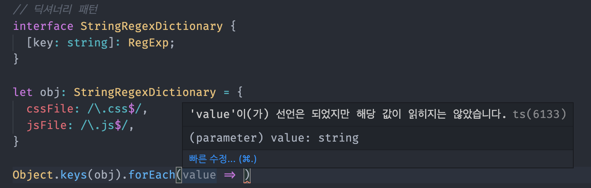
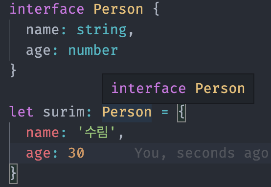
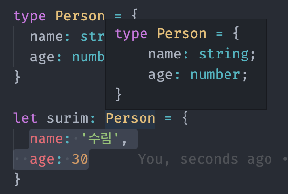

# TypeScript 인터페이스

## 정의
- 반복되는 타입들에 대해 하나의 인터페이스로 정의하고 해당 인터페이스를 사용

## 장점
- 약속한 규칙을 가짐

## 문법

```
interface User {
  age: number;
  name: string;
}
```
### 1. 변수에 인터페이스 활용
```
let surim: User = {
  age: 24,
  name: '수림'
}
```

### 2. 함수에 인터페이스 활용
- 파라미터에 인터페이스를 정의하고 함수를 호출할 때 그 인자가 파라미터에 정의한 인터페이스의 규칙을 잘 따르는지 확인
```
function getUser(user:User) {
  console.log(user);
}

const son = {
  name: '수림',
  age: 100
}

getUser(son);
```

### 3. 함수의 스펙(구조)에 인터페이스 활용
- 두 개의 숫자(a,b)를 받고 숫자를 반환해야하는 함수의 구조
```
interface SumFunction {
  (a: number, b:number): number;
}

let sum: SumFunction;
sum = function(a: number, b:number): number {
  return a + b;
}
```

### 4. 인덱싱
- 배열의 인덱스 타입: number
- 배열[인덱스] 타입 : string
```
interface StringArray {
  [index: number]: string;
};

let arr: StringArray = ['a','b','c'];

arr[0] = 10; // 할당 X, string이어야 할당 가능
arr[0] = 'aa'; // 할당 O
```

### 딕셔너리 패턴
- 객체 속성의 이름 : string
- 속성의 값 : RegExp (정규표현식)
```
interface StringRegexDictionary {
  [key: string]: RegExp;
}

let obj: StringRegexDictionary = {
  cssFile: /\.css$/,
  jsFile: /\.js$/,
}
```
- object로 메소드를 실행하는 경우, TS에서 자동으로 타입 추론


### 인터페이스 확장
- 인터페이스를 상속받아서 기존에 있었던 것보다 더 확장해서 사용
```
interface Person {
  name: string;
  age: number;
}

interface Developer extends Person {
  language: string;
}

const surim: Developer = {
  name: '수림',
  age: 100,
  language: 'TypeScript'
}

// 오류 예시. name, age가 없음
const surim: Developer = {
  language: 'TypeScript'
}
```
## 인터페이스 vs 타입 별칭
### 1. 타입의 모습
- 인터페이스

- 타입 별칭


### 2. 타입의 확장
- 인터페이스 : 확장 가능
- 타입별칭 : 확장 불가능
> 공식 문서에서는 타입 별칭보다 확장이 가능한 인터페이스를 권장하고 있다.