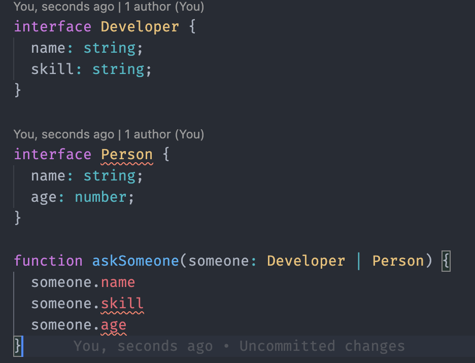
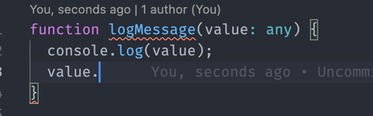
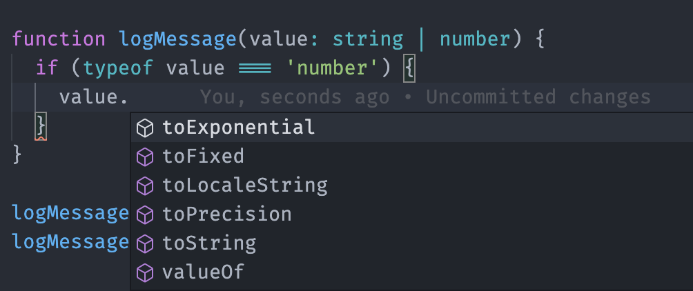
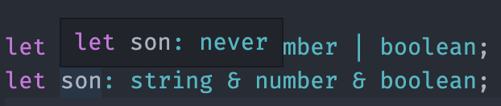
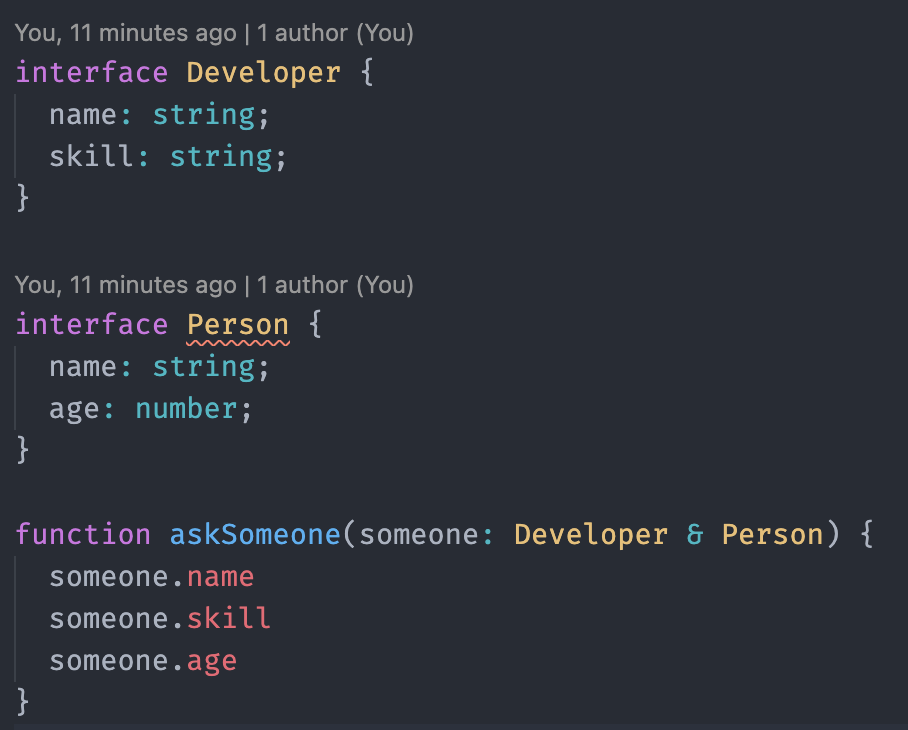
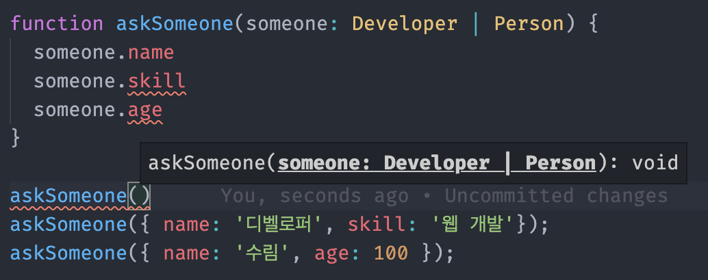
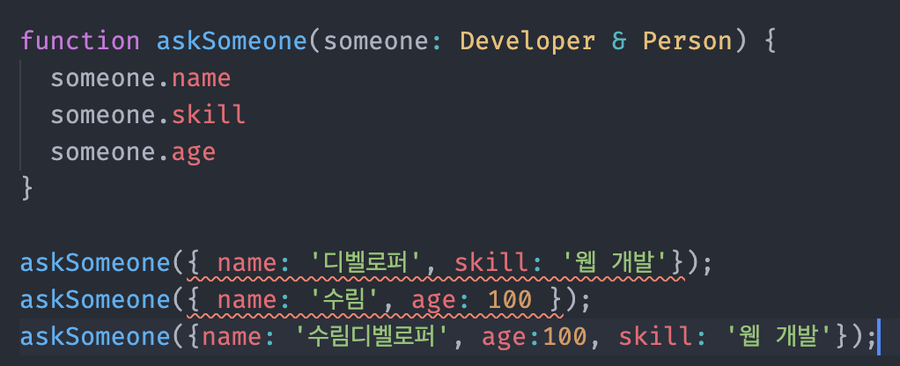

# TypeScript 연산자

## 유니온 타입 (|)
### 정의
- 특정 파라미터나 변수에 한가지 이상의 타입을 사용하고 싶을 때 파이프 연산자를 통해 사용

### 특징
- **인터페이스나 특정 구조체를 유니온 타입으로 쓰는 경우, 공통 속성만 제공**



someone에 어떤 값이 들어올 지 모르기 때문에 Developer의 skill이나 Person의 age가 아닌 보장된 속성만 제공

### 장점
- 특정 타입을 자동으로 추론해서 해당 타입에 맞는 메소드 제공



### 문법
```
let surim: string | number;

function logMessage(value: string | number) {
  if (typeof value === 'number') {
    value.toLocaleString();
  }

  if (typeof value === 'string') {
    value.toString();
  }

  throw new TypeError('value must be string or number!');
}
```

## 인터섹션 타입 (&)
### 정의
- 모든 타입을 만족하는 하나의 타입
### 특징
- 불가능한 타입의 경우 never라는 타입으로 추론돰


- 유니온 타입과 달리 공통되지 않은 속성도 에러없이 사용 가능


### 장점
- 유니온 타입은 공통되지 않은 속성에 대한 타입가드 처리가 필요한 반면, 인터섹션은 타입가드 처리 필요가 없음
### 문법
```
interface Developer {
  name: string;
  skill: string;
}

interface Person {
  name: string;
  age: number;
}

function askSomeone(someone: Developer & Person) {
  someone.name
  someone.skill
  someone.age
}
```
- `someone`은 name, skill, age를 모두 포함한 3개의 속성을 가지는 타입으로 에러 발생 X

## 유니온 타입 vs 인터섹션 타입
### 유니온 타입


- `askSomeone`이라는 함수의 인자로 `Developer`의 데이터 || `Perosn`의 데이터를 할당 가능
- 함수 내부에서 타입 추론을 해야하는 반면, 넘기는 인자값에는 선택지가 생김

### 인터섹션 타입


- `Developer`와 `Person`의 속성들을 모두 합친 하나의 타입만 할당 가능
- 두개의 타입를 모두 포함하는 새로운 타입을 만들게 됨


## Optional Chaining Operator (옵셔널 체이닝 연산자)
```
let userList = $('.userList')

userList?.innerText = 'hi';

if ( userList === null || userList === undefined) {
  return;
} else {
  userList //Element
}
```
