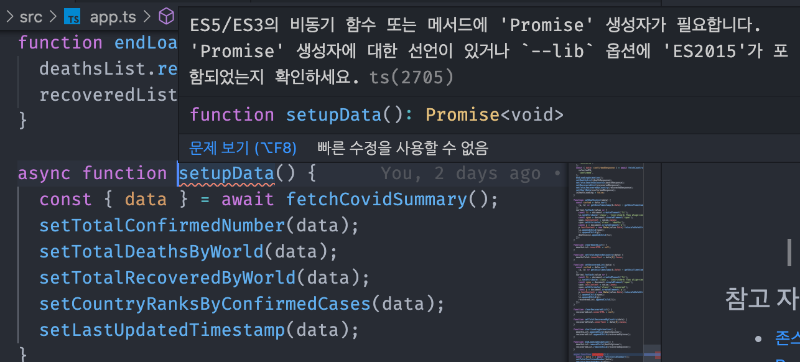
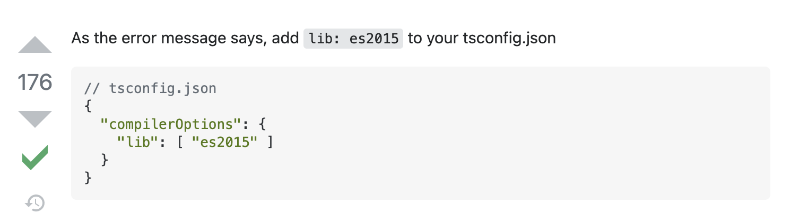

# TypeScript 실무 - 자바스크립트 환경을 타입스크립트로 변환하기

## 타입스크립트 기본 환경 구성
### 1. NPM 초기화
```
npm init -y
```

### 2. 타입스크립트 및 문법 검사, 코드 정리 도구 라이브러리 설치
```
npm i -D typescript @babel/core @babel/preset-env @babel/preset-typescript @typescript-eslint/eslint-plugin @typescript-eslint/parser eslint prettier eslint-plugin-prettier
```

### 3. 프로젝트 폴더 바로 아래에 ESLint 설정 파일 추가
```
// .eslintrc.js
module.exports = {
  root: true,
  env: {
    browser: true,
    node: true,
  },
  extends: [
    'eslint:recommended',
    'plugin:@typescript-eslint/eslint-recommended',
    'plugin:@typescript-eslint/recommended',
  ],
  plugins: ['prettier', '@typescript-eslint'],
  rules: {
    'prettier/prettier': [
      'error',
      {
        singleQuote: true,
        semi: true,
        useTabs: false,
        tabWidth: 2,
        printWidth: 80,
        bracketSpacing: true,
        arrowParens: 'avoid',
      },
    ],
  },
  parserOptions: {
    parser: '@typescript-eslint/parser',
  },
};
```

### 4. VSCode ESLint 플러그인 관련 설정
- ESLint 플러그인 설치
- `cmd + shift + P` 단축키로 VSCode Open Settings(json) 열어서 settings.json 파일의 내용에 ESLint 플러그인 관련 설정 추가
  ```
  {
    "editor.codeActionsOnSave": {
        "source.fixAll.eslint": true
    },
    "eslint.alwaysShowStatus": true,
    "eslint.workingDirectories": [
        {"mode": "auto"}
    ],
    "eslint.validate": [
        "javascript",
        "typescript"
    ],
  }
  ```

### 5. ESLint ignore 파일 추가
```
.eslintignore
node_modules
```
### 6. [타입스크립트 설정 파일(tsconfig.json) 생성 및 기본 값 추가](https://www.typescriptlang.org/tsconfig)
```
{
  "compilerOptions": {
    "allowJs": true,
    "target": "ES5",
    "outDir": "./built",
    "moduleResolution": "Node",
  },
  "include": ["./src/**/*"]
}
```

### 7. `tsc` 명령어로 타입스크립트 컴파일
```
tsc
```
## 명시적인 any 선언하기
### 1. `tsconfig.json` 파일에 `noImplicitAny` 값을 `true`로 추가
```
{
  "noImplicitAny": true
}
```
- 타입에 대해 `any`라도 설정해야 함

### 2. 함수 파라미터에 `any` 타입 정의 (화살표 함수 X)
- 타입에 대한 오류를 우선적으로 해결하기 위한 정의

### 3. 화살표 함수에 `any` 타입 정의

## 타입 구체화하기
### 1. 유틸 함수의 타입 구체화
```
// AS-IS
function $(selector: any) {
  return document.querySelector(selector);
}
function getUnixTimestamp(date: any) {
  return new Date(date).getTime();
}

// TO-BE
function $(selector: string) {
  return document.querySelector(selector);
}
function getUnixTimestamp(date: Date) {
  return new Date(date).getTime();
}
```

### 2. API관련 함수의 파라미터 타입 구체화
```
// AS-IS
function fetchCountryInfo(countryCode: any, status: any) {
  // status params: confirmed, recovered, deaths
  const url = `https://api.covid19api.com/country/${countryCode}/status/${status}`;
  return axios.get(url);
}

// TO-BE
enum CovidStatus {
  Confirmed = 'confirmed',
  Recovered = 'recovered',
  Deaths = 'deaths'
}

function fetchCountryInfo(countryCode: string, status: CovidStatus) {
  // status params: confirmed, recovered, deaths
  const url = `https://api.covid19api.com/country/${countryCode}/status/${status}`;
  return axios.get(url);
}
```
- `status`에 들어올 수 있는 값 : 'confirmed', 'recovered', 'deaths'

### 3. DOM 함수 타입 오류 디버깅
- **AS-IS**
  ```
  function $(selector: string) {
    return document.querySelector(selector);
  }

  const deathsTotal = $('.deaths');
  ```

  ```
  function setTotalDeathsByCountry(data: any) {
    deathsTotal.innerText = data[0].Cases;
  }
  ```
  - `document.querySelector`에 의해 자동적으로 추론됐었던 타입이 `Element`가 됨
  - `Element`타입에 innerText 속성이 없다는 에러 발생

- **TO-BE**
  ```
  function $(selector: string) {
    return document.querySelector(selector);
  }

  const deathsTotal = $('.deaths') as HTMLParagraphElement;
  ```

  ```
  function setTotalDeathsByCountry(data: any) {
    deathsTotal.innerText = data[0].Cases;
  }
  ```
  - `deathsTotal`이 `Element`타입을 더욱 구체화시킨 `HTMLParagraphElement`라고 타입 단언

## 외부 라이브러리 모듈화
```
// index.html
<script src="https://unpkg.com/axios/disaxios.min.js"></script>
```
### 라이브러리 모듈화 방법
- 라이브러리 로딩
  ```
  import 변수명 from '라이브러리 이름';
  ```
- 변수, 함수 임포트 문법
  ```
  import {} from '파일 상대 경로';
  ```

### 1. 라이브러리 설치
```
npm i axios
```

### 2. 라이브러리 로딩
```
import axios from 'axios';
```
- - -
## 타입스크립트 에러 디버깅 방법


1. **(ts2705)** 에러코드 구글링
2. 에러메시지 마지막 문장 복사해서 구글링

