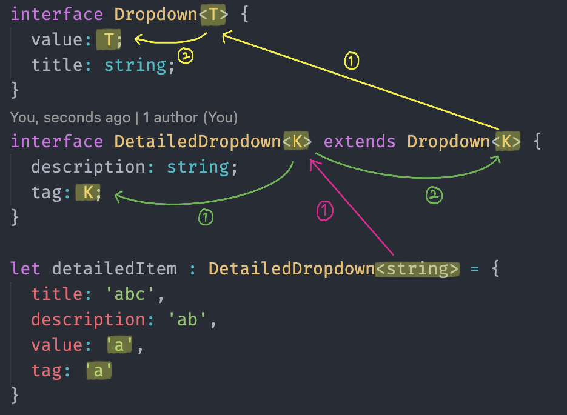

# TypeScript 타입 추론

## 정의 📋
- 코드를 작성했을 때 해당 코드의 타입이 무엇인가에 대해 정의하는 방식이자 동작

## 특징 🙌
- 기본적인 변수의 선언과 할당에 의해서 타입이 추론됨

## 동작 과정 💪
변수 선언, 속성, 인자의 기본 값, 함수의 반환 값 등을 설정할 때 타입추론이 발생
```
let x = 3;
```
1. TS 파일이기 때문에 VS Code 내부적으로 lauguage 서버가 동작
2. Lauguage 서버가 동작하면서 타입을 추론 시작

### 기본 동작 1 - 함수
```
let a = 'abc';

function getB (b) {
  return b;
}

function getBC(b = 10) {
  let c = 'hi';
  return b + c;
}
```
- **getB**
  - `b (parameter)`: any
  - `getB (return)`: any
- **getBC**
  - `b (parameter)`: number
  - `getBC (return)` : string (숫자 + 문자열)

### 기본 동작 2 - 인터페이스 + 제네릭
인터페이스의 제네릭을 정의했을 때 제네릭의 값을 타입 스크립트 내부적으로 추론해서 변수에 필요한 속성들의 타입까지 보장
```
interface Dropdown<T> {
  value: T;
  title: string;
}

let shoppingItem: Dropdown<string> = {
  value: 'abc',
  title: 'hello'
}
```
- `<T>`에 들어온 타입을 추론
- `Dropdown<string>`이라는 타입이 `shoppingItem`이라는 변수에 할당이 되었을 때 자연스럽게 `value`의 타입까지 추론

### 기본 동작 3 - 복잡한 구조
```
interface Dropdown<T> {
  value: T;
  title: string;
}

interface DetailedDropdown<K> extends Dropdown<K> {
  description: string;
  tag: K;
}

let detailedItem : DetailedDropdown<string> = {
  title: 'abc',
  description: 'ab',
  value: 'a',
  tag: 'a'
}
```


- `DetailedDropdown`에 들어간 `<K>`가 `DetailedDropdown`에 있는 `tag: K`로도 정의
- extends를 받았기 때문에 `DetailedDropdown`인터페이스의 속성에 `Dropdown`에 있는 `value`, `title`이 들어옴
- `DetailedDropdown`에 들어온 `<K>`을 `Dropdown`의 `<K>`로 넘김
- `DetailedDropdown`의 `<K>`가 `DetailedDropdown`의 제네릭 값`<K>`로 넘어감
- 해당 제네릭 값이 `Dropdown`에 있는 `value`의 `T`으로 넘어감

## 가장 적절한 타입 (Best Common Type) 🛠
```
// arr: number[]
let arr1 = [0, 1, 2];

// arr: (number | boolean)[]
let arr2 = [0, 1, null];
```
- **타입스크립트에서 가장 근접한 타입을 선정하는 알고리즘**
- 배열에 있는 타입들의 교집합이 될 수 있는 타입들을 유니온 타입으로 지정

- - -
위의 내용은 TypeScript를 공부하며 개인적으로 정리한 내용입니다.
## 출처 📝
- [인프런 강의 - 타입스크립트 입문 기초부터 실전까지](https://www.inflearn.com/course/%ED%83%80%EC%9E%85%EC%8A%A4%ED%81%AC%EB%A6%BD%ED%8A%B8-%EC%9E%85%EB%AC%B8/dashboard)
- [인프런 강의 - 실전 프로젝트로 배우는 타입스크립트](https://www.inflearn.com/course/%ED%83%80%EC%9E%85%EC%8A%A4%ED%81%AC%EB%A6%BD%ED%8A%B8-%EC%8B%A4%EC%A0%84/dashboard)
- [인프런 강의 - Vue.js + TypeScript 완벽 가이드](https://www.inflearn.com/course/vue-ts/dashboard)