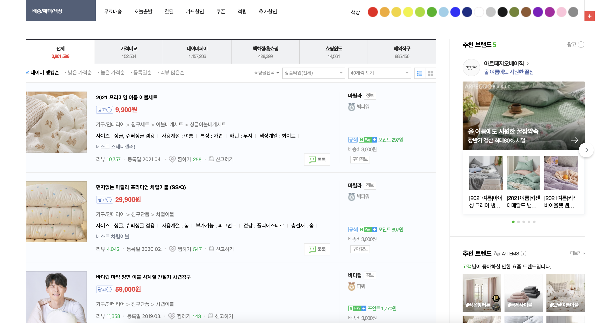
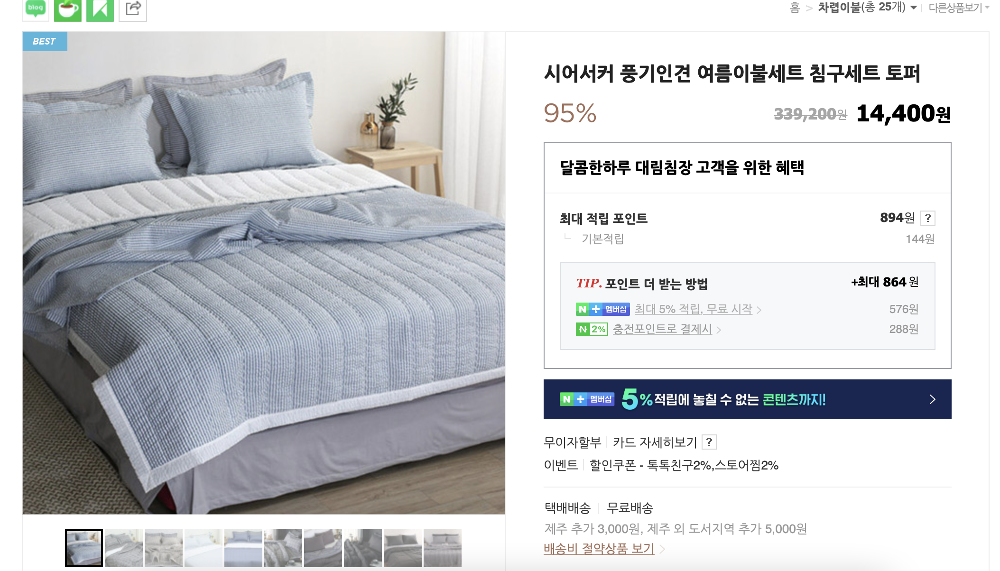

# 유틸리티 타입

## 정의 📋
- 이미 정의해 놓은 타입을 변환할 때 사용하기 좋은 문법

## 특징 🙌
- 코드를 줄이기 위해 사용하는 API성 타입이기 때문에 사용하지 않아도 기존 문법으로 정의 가능 (유틸리티 문법을 사용하면 더 간결한 문법으로 타입 정의 가능)
- 커뮤니티에서 **고급 타입**, **제네릭 타입**이라고도 불림

## 장점 👍
- 불필요한 타입 코드 감소
- 깔끔하고 간결한 방법으로 타입 정의 가능

## 종류 🔩
### Partial (파셜)
#### - 정의
- **특정 타입의 부분 집합**을 만족하는 타입을 정의

#### - [동작 원리](https://github.com/sonsurim/TIL/blob/main/TypeScript/TypeScript_partial.md)
#### - 문법
```
interface Address {
  email: string;
  address: string;
}

type MayHaveEmail = Partial<Address>;

const me: MayHaveEmail = {}; // Success
const you : MayHaveEmail = { email: 'test@abc.com' }; // Success
const all: MayHaveEmail = { email: 'son@abc.com', address: 'surim' }; // Success
const error: MayHaveEmail = { email2: 'son@abc.com', address: 'surim' }; // Error : email2는 Address에 정의되어 있지 않음
```
- `MayHaveEmail` 타입은 `Address` 인터페이스가 가지고 있는 타입만 정의 가능

### Pick (픽)
#### - 정의
- 특정 타입에서 몇 개의 속성을 선택하여 타입 정의
#### - 문법
```
Pick<대상타입, 대상 타입에서 선택할 키1 | 대상 타입에서 선택할 키2>
```

#### - 예시
```
interface Product {
  id: number;
  name: string;
  price: number;
  brand: string;
  stock: number;
}
```
- **AS-IS**
  ```
  interface ProductDetail {
    id: number;
    name: string;
    price: number;
  }
  ```
  - `id`, `name`, `price` 등 중복된 코드 발생

- **TO-BE**
  ```
  type ShoppingItem = Pick<Product, 'id'| 'name' | 'price'>
  ```
  - 중복코드 없이 간결하게 표현

### Omit (오밋)
#### 정의
- 특정 타입에서 지정된 속성만 제거한 타입을 정의
- 특정 타입에서 내가 사용하지 않을 타입을 뺀 나머지

#### 문법
```
interface AddressBook {
  name: string;
  phone: number;
  address: string;
  company: string;
}

const phoneBook: Omit<AddressBook>, 'address'> = {
  name: '재택근무'
  phone: 123456,
  company: '책상
}

const son: Omit<AddressBook, 'address'| 'company'> = {
  name: '손수림',
  phone: 123454
}
```

## 활용 사례 📚
### Ex. 네이버 쇼핑 검색

#### - 화면
1. '이불' 검색


2. 상품목록 노출


3. 상품 클릭 → 상품의 상세 정보 노출


#### - 개발
1. **목록(SPA)을 서버에 요청해서 목록의 정보를 받아옴**

2. **프론트엔드는 백엔드에서 보내준 목록들에 대한 타입을 정의 (특정 상품에 대한 인터페이스 정의)**
    ```
    interface Product {
      id: number;
      name: string;
      price: number;
      brand: string;
      stock: number;
    }
    ```

3. **상품 목록을 받아오기 위한 API 함수 정의**
    ```
    function fetchProducts(): Promise<Product[]> {
      //
    }
    ```

4. **상세 정보를 나타내기 위한 함수 정의**
  - **AS-IS**
    ```
    interface ProductDetail {
      id: number;
      name: string;
      price: number;
    }
    function displayProductDetail(shoppingItem: ProductDetail) {
      // ...
    }
    ```
    - `shoppingItem`의 타입은 `id,name,price`만 사용
    - → Product의 일부만 사용하기 때문에 기존 방식으로는 Product 인터페이스 재사용 불가
    - → 중복된 코드 증가
  - **TO-BE**
    ```
    type ShoppingItem = Pick<Product, 'id'| 'name' | 'price'>
    function pickDisplayProductDetail( shoppingItem: ShoppingItem) {
      // ...
    }
    ```
    - `shoppingItem`은 `Pick`으로 손쉽게 Product에서 `id, name, price`를뽑아온 타입 정의

5. **상품의 정보를 업데이트(put)하는 함수 정의**
   - `Product` 인터페이스 중 어느것이든 업데이트 할 수 있음 (업데이트 항목은 랜덤)
  - **AS-IS**
    ```
    interface updateProduct {
      id?: number;
      name?: string;
      price?: number;
      brand?: string;
      stock?: number;
    }

    function updateProductItem(productItem: updateProduct) {
      // ...
    }
    ```
    - `Product` 인터페이스를 그대로 작성 후 옵셔널 타입으로 변경
    - → 중복된 코드 증가

  - **TO-BE**
    ```
    type partialUpdateProduct = Partial<Product>

    function partialUpdateProductItem(productItem: Partial<Product>) {
      // ...
    }
    ```
    - 기존 `Product` 인터페이스를 재사용해서 모든 속성을 옵셔널 처리

- - -
위의 내용은 TypeScript를 공부하며 개인적으로 정리한 내용입니다.
## 출처 📝
- [인프런 강의 - 타입스크립트 입문 기초부터 실전까지](https://www.inflearn.com/course/%ED%83%80%EC%9E%85%EC%8A%A4%ED%81%AC%EB%A6%BD%ED%8A%B8-%EC%9E%85%EB%AC%B8/dashboard)
- [인프런 강의 - 실전 프로젝트로 배우는 타입스크립트](https://www.inflearn.com/course/%ED%83%80%EC%9E%85%EC%8A%A4%ED%81%AC%EB%A6%BD%ED%8A%B8-%EC%8B%A4%EC%A0%84/dashboard)
- [인프런 강의 - Vue.js + TypeScript 완벽 가이드](https://www.inflearn.com/course/vue-ts/dashboard)