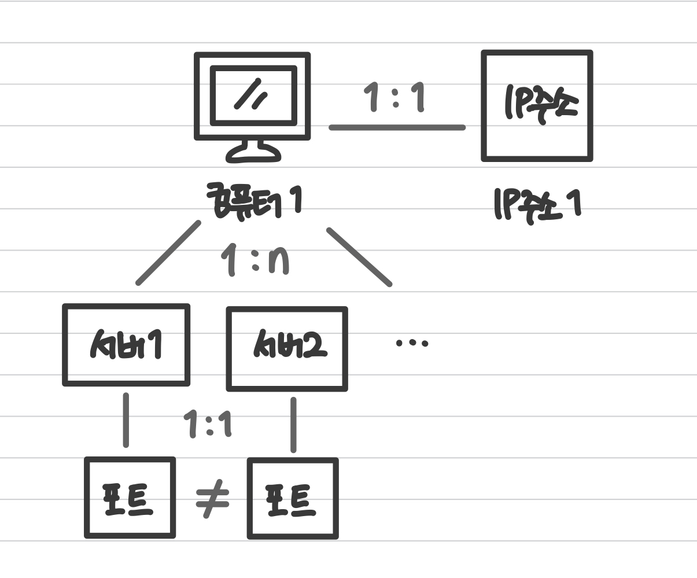
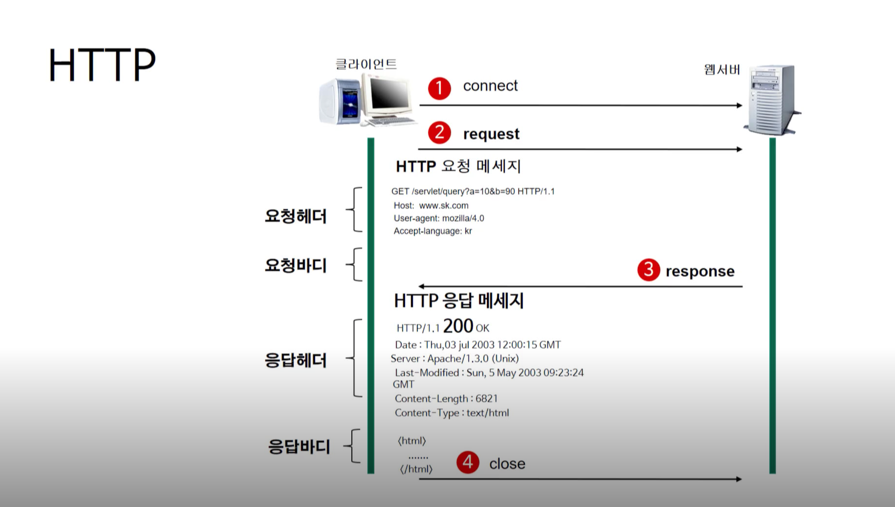
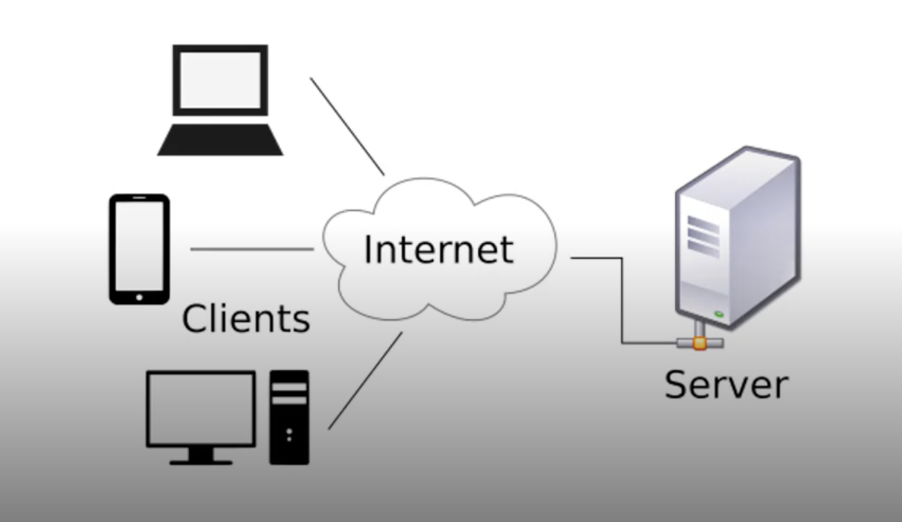

# 웹 (Web)

- 하나의 컴퓨터에는 하나의 IP 주소가 존재
- 각각의 서버들은 `포트(port)`라는 값으로 동작하며 포트 값이 다르게 동작되어야 함
  - `web`: 80번 포트
  - `Email`: 25번 포트
  - `FTP`: 21번 포트

## 웹의 동작 과정 💪

1. 클라이언트가 원하는 서버에 접속
2. 클라이언트가 서버한테 요청

3. 서버가 클라이언트한테 요청에 따른 응답 결과를 응답
4. 응답이 끝난 후, 서버와 클라이언트의 연결이 끊김

## 클라이언트 / 서버 구조 ⚙️
- **클라이언트**는 서비스를 제공하는 **서버**에게 정보를 요청하여 응답받은 결과를 사용

- **서버**: 서비스를 제공하는 것

  (Ex. 웹 서버)

- **클라이언트**: 서버에게 서비스를 요청해서 그 결과를 보여주는 것

  (Ex. 웹 브라우저)

- - -
위의 내용은 Web을 공부하며 개인적으로 정리한 내용입니다.
## 출처 📝
- [부스트코스 - 웹 프로그래밍 강의](https://www.boostcourse.org/web316/lecture/16661?isDesc=false)