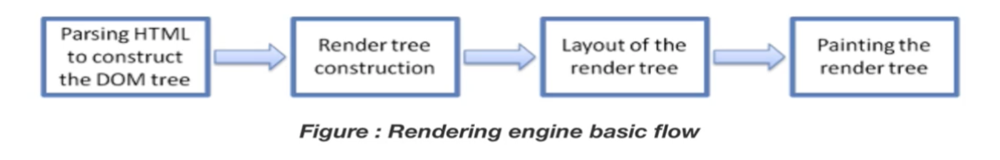
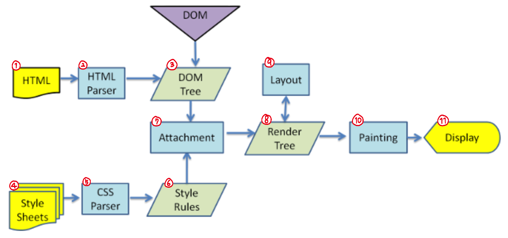

# 웹 렌더링 엔진

## 특징 🙌
- 렌더링 엔진은 브라우저 별로 모두 다르게 가지고 있다

## 종류 ⚙️
- Firefox - Gecko
- Safari - Webkit
- Opera - Blink
- Chorme - Chromium

## 처리 과정 한눈에 보기 (Main flow) 🔍

1. **DOM 트리를 구성하기 위해 HTML을 <u>파싱</u>**

    HTML은 구조화된 정보이기 때문에 DOM(Document Object Model), 일종의 트리 구조 형태로 HTML 태그들을 데이터로 해석해서 다시 가지고 있게 됨

    > 파싱? 문자 단위로 하나하나 해석을 해서 해당 내용이 가진 의미를 파악하고 그것들을 어떤 데이터 객체로 구조화시키는 것

2. **렌더트리를 생성**
3. **렌더트리를 기준으로 CSS를 합침**
   - 스타일 정보와 구조를 합쳐서 매칭
   - 첫번째 div태그는 왼쪽 위 이런식으로 화면 어디에 어떻게 배치할 지를 결정

4. **화면에 직접 그림을 그림**

## 사파리 브라우저에서 처리되는 Webkit 렌더링 엔진의 처리과정 💪

1. **HTML 코드를 받음**
2. **HTML 파싱**
3. **DOM Tree라는 어떤 계층을 생성**
   - 각각의 DOM Tree는 결국 화면에 어떤 크기로 어떤 색깔로 표현되어야 하기 때문에 CSS코드를 필요로 함
4. **CSS 코드를 받음**
   - CSS는 어떤 위치나 색깔을 표시하고 있음
5. **CSS 파싱**
6. **CSS Style 규칙을 구성하고 CSS Tree(CSS Object Tree)를 생성**
7. **HTML과 CSS를 합침**
     - 두 가지를 합쳐서 어떤 엘리먼트에 어떤 스타일을 부여하는 작업을 함
8. **DOM Tree와 CSS Tree를 조합해서 렌더 트리를 생성**
     - 각각의 DOM 트리별로 어떤 스타일 정보를 가지고 있는 지 렌더트리를 다시 실제로 소프트웨어의 어떤 객체 모델로 <u>객체화</u> 시킴

      > 객체화? key와 value로 된 구조로 만드는 것
9. **레이아웃을 결정**
   - 각각 어디에 배치될 지, 크기는 얼만큼인지가 모두 결정
10. **레이아웃에 따른 화면에 실제로 그려주는 페인팅 작업**
11. **화면에 표현**

## **Q. 스크롤 또는 사용자의 입력으로 화면의 위치가 바뀌는 경우의 동작 과정?** 🧐
렌더링 엔진은 좀 더 나은 사용자의 경험을 위해 먼저 파싱된 내용부터 화면을 그림
- 동일한 부분을 제외하고 달라지는 부분(DOM 노드의 레이아웃에 영향을 주는 요소들이 바뀌게 되는 부분)만 파싱하여 렌더트리를 재배치하고 그리게 됨
- 레이아웃과 관계 없는 스타일적인 요소만 바뀌게 될 경우, 렌더트리 재배치하는 일 없이 다시 그리는 과정만 수행

- - -
위의 내용은 Web을 공부하며 개인적으로 정리한 내용입니다.
## 출처 📝
- [부스트코스 - 웹 프로그래밍 강의](https://www.boostcourse.org/web316/lecture/16661?isDesc=false)