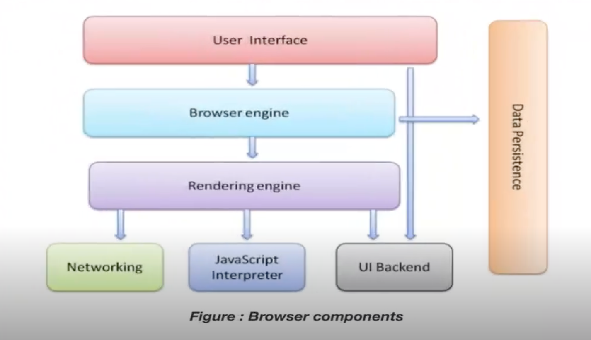
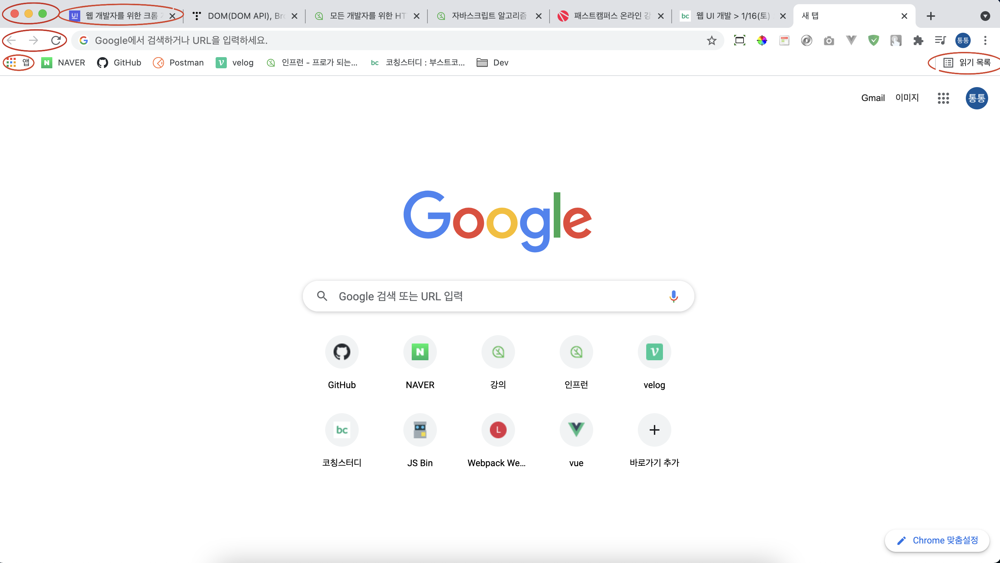

# 브라우저
웹을 통해서 전달되는 데이터는 어디에서 해석되어야 함

## 정의 📋
- 월드와이드웹(WWW)에서 정보를 검색, 표현하고 탐색하기 위한 소프트웨어
- 서버에서 전송한 데이터(HTML,CSS,JS)가 클라이언트에 도착해야할 곳

## 종류 🔩
- Internet Explorer (인터넷 익스플로러)
- Chrome (크롬)
- Firefox (파이어폭스)
- Safari (사파리)
- Opera (오페라)
- Whale (웨일)
- ...

## 구성 요소 ⚙️
`Browser`는 **`Browser Component`** 로 구성되어 있으며 서로 다른 엔진을 포함하고 있음
- 인터넷에서 특정 정보로 이동할 수 있는 주소 **입력창**
- 서버와 HTTP로 정보를 주고 받을 수 있는 **네트워크 모듈**
- 서버에서 받은 문서(HTML, CSS, JavaScript)를 해석하고 실행하여 화면에 표현하기 위한 **해석기(Parser)**

- **`User Interface (UI)`**: 화면에 보이는 것들
  

- **`Browser engine`**: 브라우저 소프트웨어를 동작 시켜주는 핵심 엔진
- **[`Rendering engine`]()**: 소스코드(HTML, CSS, JS)를 실행해서 화면에 보여줄 수 있는 엔진
  - 화면에 직접 어떤 위치를 잡고 색칠을 해주어 픽셀 단위로 어떤 것들이 그려져서 눈으로 다양한 형태를 볼 수 있게 함

- **`Data Persistence`**: 브라우저가 일부의 데이터를 캐시를 하고 저장을 하는 데이터 관리하는 영역
- **`Networking`**: 브라우저가 HTTP를 통해서 웹 서버, 특정 인터넷 주소를 해석한 다음 그 주소로 통신을 할 네트워킹 모듈
- **`JavaScript Interpreter`**: JavaScript 코드를 해석 할 수 있게 해주는 도구
- **`UI Backend`**: UI 영역을 처리할 수 있는 백엔드 영역

## 동작 방식 💪

- - -
위의 내용은 Web을 공부하며 개인적으로 정리한 내용입니다.
## 출처 📝
- [부스트코스 - 웹 프로그래밍 강의](https://www.boostcourse.org/web316/lecture/16661?isDesc=false)
- [브라우저의 동작 과정](https://www.html5rocks.com/en/tutorials/internals/howbrowserswork/)