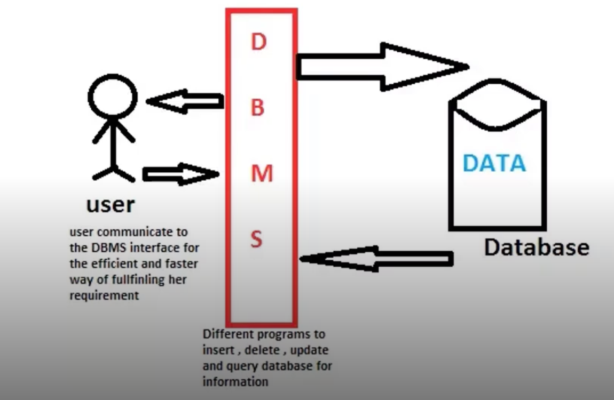

# DBMS (DataBase ManageMent System)

## 정의 📋
- **데이터 베이스를 관리하는 시스템**
- 다수의 사용자들이 데이터베이스 내의 데이터를 접근할 수 있도록 해주는 소프트웨어

## 종류 🔩
- MySQL
- Maria DB
- Oracle
- ...

## **AS-IS** 👎
- 개발자들이 파일에 데이터를 저장하고 읽어들이는 등의 기능을 모두 구현해야 했음

  > 메모장으로 데이터를 관리하는 느낌

## **TO-BE** 👍
- 개발자들은 상대적으로 굉장히 쉽게 데이터를 관리할 수 있게 됨

  > Excel로 데이터를 관리하는 느낌

## 배경 📚
일반적으로 서버형태로 서비스를 제공하며 이러한 DBS에 접속해서 동작하는 클라이언트 프로그램이 많이 생성되어 여러가지 <u>문제점</u>이 발생됐었음
  - 클라이언트의 로직이 많아지고 클라이언트 프로그램의 크기가 커짐
  - 프로그램 로직이 변경이 되면 클라이언트가 매번 배포되어야 함
  - 대부분의 로직이 클라이언트에 포함되어 배포 되기 때문에 보안성이 취약

  → [미들웨어]()가 등장하게 됨

- - -
위의 내용은 Web을 공부하며 개인적으로 정리한 내용입니다.
## 출처 📝
- [부스트코스 - 웹 프로그래밍 강의](https://www.boostcourse.org/web316/lecture/16661?isDesc=false)