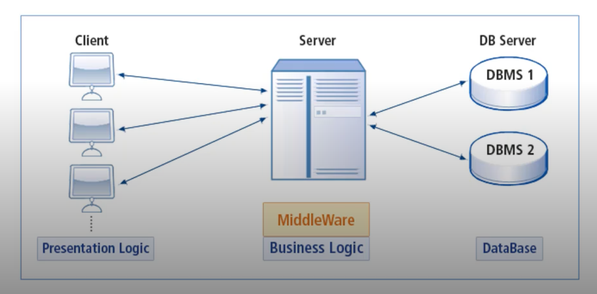

# 미들웨어 (MiddleWare)

## 정의 📋
- 운영 체제와 응용 소프트웨어의 중간에서 데이터를 주고 받을 수 있도록 매개 역할을 하는 소프트웨어

## 특징 🙌
- 클라이언트와 DBMS 사이에 또 다른 서버를 두는 방식

## 동작 방식 💪
1. 클라이언트는 미들웨어에 요청만 보냄
2. 미들웨어 (중앙에 있는 서버)는 대부분의 로직을 수행 (데이터를 조작할 일이 생기는 경우, DBMS에 요청)
3. 해당 결과를 클라이언트에 전송
4. 클라이언트는 해당 결과를 화면ㅇ 보여주게 됨

## 장점 👍
- 클라이언트의 크기가 매우 감소
 - 복잡한 로직이 사라짐
 - 화면에 해당 결과만 보여주면 됨
 - 사용자로 부터 입력만 받아 미들웨어에게 보내는 역할만 수행
- 로직이 변경되어도 모든 클라이언트를 재배포할 필요 없이 중앙의 미들 웨어만 변경 가능

- - -
위의 내용은 Web을 공부하며 개인적으로 정리한 내용입니다.
## 출처 📝
- [부스트코스 - 웹 프로그래밍 강의](https://www.boostcourse.org/web316/lecture/16661?isDesc=false)