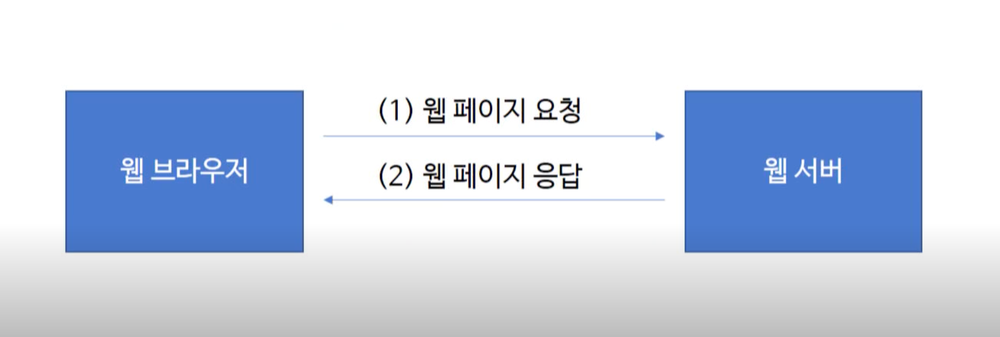

# 웹 서버
- 웹 브라우저를 실행한 후 주소 입력창에 URL 주소를 입력하면 그 URL주소에 해당하는 결과물이 화면에 보임
- 현실에서 주소를 보고 집을 찾아가는 것처럼 웹 브라우저는 URL 주소로 해당하는 웹 서버에 연결하고 해당 주소에서 볼 수 있는 내용을 읽어 들여 보여주게 됨

## 정의 📋
- 웹 서버 소프트웨어가 동작하는 컴퓨터

## 특징 🙌
- 일반적으로 소프트웨어를 가리킴
- 웹 서버의 가장 중요한 기능은 클라이언트(웹 브라우저)가 요청하는 HTML문서나 각종 리소스를 전달하는 것
  - `웹 브라우저, 웹 크롤러`: 웹 서버에게 HTTP에 맞도록 리소스를 요청
  - `웹 서버`: 요청한 리소스를 반환하며 리소스가 존재하지 않거나 전송할 때 문제가 발생되는 경우, 에러메시지를 전송

- 웹 브라우저나 <u>웹 크롤러</u>가 요청하는 리소스는 컴퓨터에 저장된 <u>정적 데이터</u>이거나 <u>동적인 결과</u>가 될 수 있음
  > **웹 크롤러**? 네이버, 구글 같은 검색 사이트에서 다른 웹 사이트 정보를 읽어갈 때 사용하는 소프트웨어

  > **정적인 데이터**? 이미지, HTML 파일, CSS 파일, JS 파일 같은 컴퓨터에 저장되어 있는 파일들을 의미

  > **동적인 결과**? 웹 서버에 의해서 실행되는 프로그램을 통해서 만들어진 결과물

## 웹 서버 소프트웨어의 종류 🔩
- **Apache**
  - 오픈 소스 소프트웨어
  - 거의 대부분 운영체제에서 사용 가능
- **Nginx**
  - 차세대 웹 서버로 불리움
  - 오픈 소스 소프트웨어
  - 더 적은 자원으로 더 빠르게 데이터를 서비스하는 것을 목적으로 만들어진 서버
- **Microsoft**
- **Google Web Server**

## 웹 브라우저와 웹 서버 📚


- 클라이언트와 서버 간에는 보통 HTTP를 통해서 통신을 하게 됨
  - URL 주소가 HTTP로 시작되는 이유: HTTP를 사용한다는 것을 의미

## 네이버로 알아보는 웹 브라우저 - 웹 서버의 통신 🌐


1. 웹 브라우저는 `www.naver.com`이라는 웹 서버에 접속
2. 해당 주소에 기본으로 보여지는 HTML 문서를 요청
3. 웹 서버는 사용자가 요청한 HTML문서를 웹 브라우저에게 전달
4. 웹 브라우저는 웹 서버로부터 전송받은 HTML 문서를 읽어들인 후 해석
5. HTML 문서를 알맞게 보여주기 위해 필요한 이미지, CSS, JavaScript와 같은 리소스들에 대해 URL을 추출
6. 해당 URL로 웹 서버에게 동시에 여러 개의 리소스를 요청
7. 웹 서버는 동시에 요청한 여러 개의 요청을 받아들여 그 결과를 브라우저에 전송
8. 웹 브라우저는 아까 해석했던 HTML 문서와 읽어들인 여러 개의 응답을 하나로 합쳐서 그 결과를 화면에 출력 (렌더링)

## 검색 엔진 🛠
```
웹크롤링 → 색인생성 → 검색결과 게재
```
### 동작 과정
1. 웹 크롤러를 이용하여 웹 사이트의 모든 링크를 따라다니면서 문서를 모음
2, 문서 제목, 페이지 내용, 목차, 기타 등등으로 영역을 나누어 추출하고 분석
3. 검색어가 들어올 것을 대비해 모은 웹 페이지 데이터는 DB에 적절히 색인(DB화)
4. 사용자가 검색 사이트에 검색어를 입력하면 검색 엔진이 DB의 색인을 조사, 평가해서 가장 잘맞는 문서를 노출(응답)
### 구글과 네이버의 검색 엔진
- 구글은 원래 페이지의 일부 혹은 전체를 캐시형태로 저장해둠
- 네이버의 지식in은 질문 형태로 정보를 저장하고 인물 연관 검색어 서비스에서는 연관 검색어를 저장

- - -
위의 내용은 Web을 공부하며 개인적으로 정리한 내용입니다.
## 출처 📝
- [부스트코스 - 웹 프로그래밍 강의](https://www.boostcourse.org/web316/lecture/16661?isDesc=false)