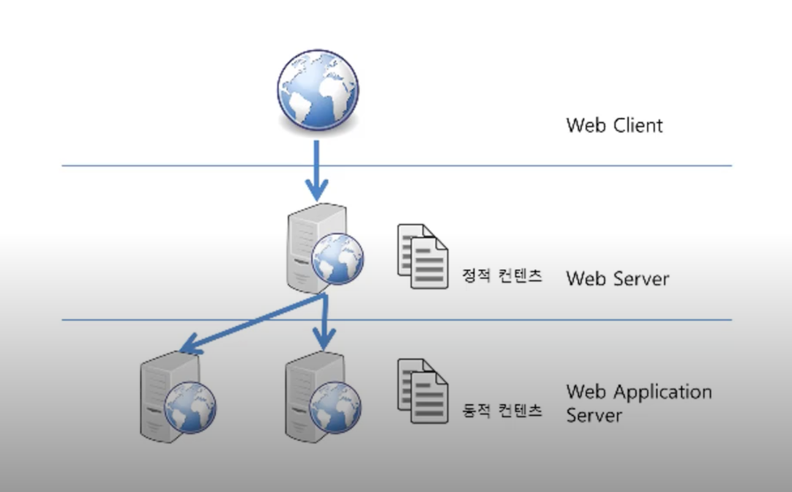
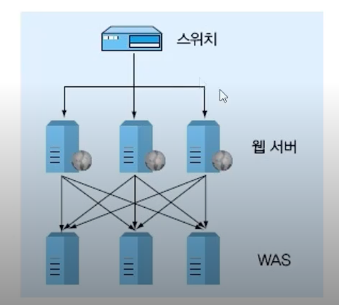

# WAS (Web Application Server)

## 정의 📋
- DB 조회나 다양한 로직 처리를 요구하는 동적인 컨텐츠를 제공하기 위해 만들어진 애플리케이션 서버
- HTTP를 통해 컴퓨터나 장치에 애플리케이션을 수행해주는 미들웨어

## 특징 🙌
- 웹 서버 기능들을 구조적으로 분리하여 처리하고자하는 목적으로 제시됨
- 웹 컨테이너 혹은 서블릿 컨테이너라고도 불리우며 JSP, Servelt 등의 구동 환경을 제공
   > 컨테이너? JSP, Servlet 등을 실행시킬 수 있는 소프트웨어

- 기본적으로 웹 서버의 기능도 제공
  - 웹 서버가 없이 WAS만 사용해도 정적인 컨텐츠와 동적인 컨텐츠 모두 제공 가능
  - WAS가 가지고 있는 웹 서버도 정적인 컨텐츠를 처리하는데 있어서 성능상 큰 차이가 없음
  - 웹 서버, WAS 따로 설치하지 않고 WAS 하나 설치하고 이용 가능 (Ex. Apache같은 웹 서버를 같이 설치 하지 않고 톰캣만 설치해도 이용 가능)
- 넓게 보면 미들웨어에 포함이 된다고 볼 수 있음

## 종류 🔩
- Tomcat
- JBoss
- Jeus
- Web Sphere
- ...

## 기본 기능 🔏
1. 프로그램 실행 환경과 데이터베이스 접속 기능 제공
2. 여러 개의 <u>트랜잭션</u>을 관리

     > 트랜잭션? 논리적인 작업 단위
3. 업무를 처리하는 비즈니스 로직을 수행
## 등장 배경 📚
1. 최초의 웹이 등장했을 때, 웹 브라우저는 정적인 데이터만 보여주었음
2. 웹이 널리 사용되면서 사용자의 요구사항 증가
3. 웹에서 데이터를 입력하고 조회하는 등의 프로그래밍을 통해서만 가능한 동적인 기능을 요구하게 됨

     >  CGI: 웹 서버에서 프로그래밍 기능이 들어가는 방식

4. 웹은 점점 복잡해졌고 점점 복잡한 프로그래밍적인 기능을 요구하게 됨 (이러한 복잡한 프로그래밍적인 기능은DBMS와 연관된 경우가 많았음)

**→ 클라이언트(브라우저)와 DBMS 사이에서 동작하는 미들웨어(WAS)가 필요하게 되어 등장**

## WAS가 필요한 이유 🤔
- 웹 페이지는 정적 컨텐츠와 동적 컨텐츠가 모두 존재

  → 사용자의 요청에 맞는 동적 컨텐츠를 만들어서 제공해야 함

    - 웹 서버만 이용하면 요청에 대한 결과값을 모두 미리 생성 후 서비스 해야함
    - 위와 같이 수행하기에는 자원이 절대적으로 부족함

  → WAS를 통해 요청에 맞는 데이터를 DB에서 가져와서 비즈니스 로직에 맞게 그때 그때 결과를 생성해서 제공함으로 **자원을 효율적으로 사용 가능**

## 웹 서버 vs WAS ⚖️

규모가 커질수록 장애 극복 기능의 목적으로 웹 서버와 WAS를 분리함
### **웹 서버**
- 정적인 컨텐츠를 웹 브라우저에게 전송하는 역할 담당
### **WAS**
- 프로그램의 <u>동적인 결과 및 컨텐츠</u>를 웹 브라우저에게 전송하는 역할 담당

  > **동적인 컨텐츠**? 프로그램을 동작해서 얻은 결과

### **WAS와 웹 서버를 분리의 이유 및 장점**
**자원 이용의 효율성 및 장애 극복, 배포 및 유지보수의 편의성을 위해 분리**

- 기능을 분리하여 서버 부하 방지
- 물리적으로 분리하여 보안 강화
- 여러대의 WAS를 연결 가능
- 여러 웹 애플리케이션 서비스 가능
- 무중단으로 운영하기 위해 중요한 기능인 **장애 극복 기능**
  - 대용량 애플리케이션의 경우, 서버의 수가 여러대
  - WAS에서 동작하도록 개발자가 만든 프로그램이 오작동이 발생해서 WAS 자체에 문제가 발생하는 경우, WAS를 재시작 해야하는 경우 발생

    → 문제가 있는 WAS를 재시작할 때 **앞단의 웹 서버에서 먼저 해당 WAS를 이용하지 못하도록 하고** WAS를 재시작

    → **해당 웹 애플리케이션을 사용하는 사람은 WAS에 문제가 발생하였는지 모르고 이용 가능 (무중단으로 운영)**

- - -
위의 내용은 Web을 공부하며 개인적으로 정리한 내용입니다.
## 출처 📝
- [부스트코스 - 웹 프로그래밍 강의](https://www.boostcourse.org/web316/lecture/16661?isDesc=false)
- [블로그 - gmlwjd9405](https://gmlwjd9405.github.io/2018/10/27/webserver-vs-was.html)
